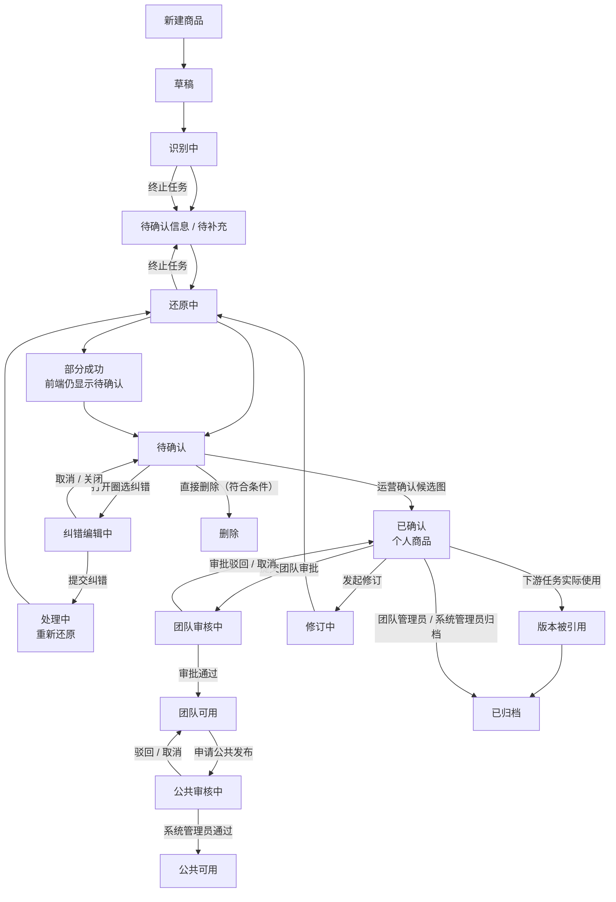

# 商品学习与商品库 MVP 原型交接方案

> 文档状态：业务方案已确认，前端交互原型已完成并验证
> 确认日期：2026-09-02
> 文档版本：V1.1（2026-09-04 更新商品库审批口径）
> 关联项目：先马 AI 设计平台
> 当前阶段：本地前端交互原型已验证，不代表接口、模型链路、生产数据持久化、服务端权限、部署或上线已完成
> 文档性质：业务与前端原型交接基线，不是开发 PRD，不构成后端开发或上线授权

## 1. 结论

本期以“商品智库”为产品名称，建设轻量商品学习与团队商品库 MVP，先解决 AI 对具体商品认知不足、还原结果改变商品身份的问题。

MVP 完整闭环为：

```text
自主上传（默认）/ 商品链接导入（辅助）
→ AI 整理图片与提取商品信息
→ 运营确认信息覆盖情况
→ AI 每轮生成 2 张标准商品还原候选图
→ 待确认：运营确认 / 提交圈选纠错 / 删除未发布且未被下游使用的个人商品
→ 运营确认后保留在个人商品库
→ 提交团队审批 → 团队商品库
→ 申请公共发布 → 公共商品库
```

状态口径固定为：AI 输出完成进入“待确认”；运营确认后底层状态为“已确认”，商品仍属于个人范围；提交团队审批后进入“团队审核中”，通过后进入团队商品库；团队商品申请公共发布后进入“公共审核中”，通过后进入公共商品库。提交纠错后进入“处理中”，重新输出完成后回到“待确认”；仅打开或取消圈选纠错不改变商品状态。

本期闭环到“商品还原确认并完成团队发布审批”为止，不接场景验证、主体替换、AI 买家秀或 AI 商品套图。商品确认只能证明商品认知与还原链路成立，不能据此宣称下游出图质量已经提升。

## 2. 背景与真实问题

当前平台已有主体替换、AI 买家秀、AI 商品套图、素材库等相关能力，但商品图片与商品规则分散，没有形成统一、经过运营确认的具体商品档案。

真实失败案例中，运营提供了商品实拍图和目标参考图，AI 输出虽然保留了人物、姿势和环境，却改变了商品的外形比例、分区、拉链、开口、内衬、线材、材质、花纹和使用尺度，结果已经变成另一款商品，运营无法使用并放弃平台。

因此，本需求不是让 AI 只识别商品品类，而是建立具体商品的身份标准，避免 AI 在后续生成中重新设计商品。

## 3. 当前平台事实基线

### 3.1 已核实事实

- 平台当前已有“品类”概念。
- 2026-08-25 基线中，现网和当时的本地前端参考工程均未发现独立商品库入口或完整商品管理实现；截至 2026-09-02，本地参考工程已新增商品智库完整前端交互原型，现网状态未据此改变。
- 当前已有素材库、提示词库、AI 买家秀、AI 商品套图和主体替换等分散承载能力。
- 当前权限产品基线为普通用户、部门管理员、审批员、系统管理员四类平台身份，可叠加；钉钉主管是同步标识，不是平台角色。
- 账号、组织、所属部门、主管标识和账号状态应由聚合管理平台同步钉钉事实。
- 页面权限、操作权限、组织数据范围和单条资源可见范围必须独立判断。
- 素材、提示词和权限管理的前端交互原型已存在，但真实资源服务、组织同步、服务端鉴权、持久化和审计仍处于待开发状态。

### 3.2 已有能力对比

本需求属于“已有部分能力需要增强”：

- 已有：图片上传与素材选择、图片预览、生成任务、历史结果、局部编辑、组织与资源权限原型。
- 缺少：统一商品档案、商品信息证据映射、商品信息覆盖情况、商品还原确认、商品纠错与团队商品共享闭环。

## 4. 产品目标与非目标

### 4.1 产品目标

1. 让 AI 基于多张商品图片和明确规则形成可核验的商品认知档案。
2. 用标准商品还原图证明 AI 是否正确认识该商品。
3. 让运营只处理 AI 无法确认或识别错误的关键信息，降低上传和填写负担。
4. 通过圈选纠错、补充说明和补图形成可重复迭代的还原闭环。
5. 将完成团队审批的商品沉淀为团队可复用资产，为后续主体替换、买家秀和商品套图接入预留基础。

### 4.2 MVP 不做

- 不做场景验证图或场景模板。
- 不接主体替换、AI 买家秀、AI 商品套图等下游模块。
- 不为每个商品训练专属模型或微调模型。
- 不强制生成正面、侧面、背面或 360 度固定图组。
- 不生成缺少证据的背面、内部、底部或隐藏结构。
- 不自动发现或抓取商城链接；只处理运营主动粘贴的链接。
- 不做批量链接导入、批量商品学习或自动同步商城后续变化。
- 不新增 SPU、SKU、款式树或复杂商品主数据体系。
- 采用与素材库、提示词库一致的个人→团队→公共两级审批；不做复杂审批流或多级会签。
- 不做下游实际效果指标闭环，不把还原确认当作主体替换质量提升证据。

## 5. 核心概念

### 5.1 商品档案

一个商品档案代表一个“视觉 SKU”，保存：

- 基础信息：商品名称、现有品类、规格信息、来源方式。
- 原始证据：上传图片、链接导入图片、用户补充图片。
- 商品事实：外形、比例、颜色、材质、图案、部件、结构关系、固定标识等。
- 信息状态：已确认、AI 推断、待补充。
- 证据关系：每项商品信息对应的原始图片来源。
- 还原结果：每轮 2 张候选图、运营选择、纠错记录和最终确认图。
- 权限信息：创建人、所属组织、团队可见组织、当前范围和状态。
- 过程信息：创建时间、更新时间、确认人、确认时间和版本记录。

### 5.2 视觉 SKU 粒度

- 颜色、花型、外形或结构不同：分别创建商品档案。
- 只有尺寸不同且外观结构完全一致：共用商品档案，将尺寸保存为规格信息。
- 尺寸变化导致外形比例或结构变化：分别创建商品档案。
- 商品链接中存在多个视觉 SKU 时，本次只选择一个视觉 SKU 创建档案，不保存完整商城 SKU 树。

### 5.3 商品学习

“商品学习”是用户侧产品名称。MVP 技术含义是多图理解、商品事实提取、原始证据引用、规则约束和商品还原，不等同于为每个商品训练或微调专属模型。

### 5.4 商品信息覆盖情况

不使用抽象的“可用范围”，统一展示：

- 已确认信息：有明确图片或用户确认作为证据。
- AI 推断信息：AI 根据图片推断，尚未得到运营确认。
- 待补充信息：当前资料无法确认，例如背面、内部或遮挡部位。

未知信息不阻断还原，但不能标记为已学习或已确认，也不能被 AI 擅自补全。

## 6. 用户与权限规则

### 6.1 平台身份

- 普通用户：所有有效账号的基础身份。
- 部门管理员：管理授权组织范围内的团队商品。
- 审批员：处理授权范围内的商品入团队审批；不因此获得团队商品编辑或删除权。
- 系统管理员：查看和管理全公司商品，负责公共商品。
- 钉钉主管：同步身份标识；实际商品权限按有效平台角色计算，不能仅凭主管标识放权。

### 6.2 商品库视图

- 我创建的：本人创建的待完善、处理中、待确认和已发布来源记录。
- 团队商品：对当前用户所属组织开放的已确认商品。
- 公共商品：全公司有效账号可见，仅系统管理员发布和管理。

同一商品只保留一个资源 ID，通过不同视图展示，不复制多份商品数据。

### 6.3 权限矩阵

| 操作 | 普通用户 | 部门管理员 | 审批员 | 系统管理员 |
|---|---|---|---|---|
| 进入商品库 | 可以 | 可以 | 可以 | 可以 |
| 查看本人草稿和学习记录 | 可以 | 仅本人 | 仅本人 | 全部 |
| 创建商品 | 可以 | 可以 | 可以 | 可以 |
| 上传、导入、补充、学习和纠错 | 仅本人商品 | 仅本人商品 | 仅本人商品 | 任意商品 |
| 确认本人还原结果 | 可以 | 可以 | 可以 | 可以 |
| 查看团队商品 | 命中资源可见组织 | 命中资源可见组织或管理范围 | 命中资源可见组织 | 全部 |
| 查看公共商品 | 可以 | 可以 | 可以 | 可以 |
| 提交本人商品入团队审批 | 可以 | 可以 | 可以 | 可以 |
| 审批商品入团队 | 不可以 | 授权范围内可以 | 授权范围内可以 | 可以 |
| 申请团队商品公共发布 | 本人创建的团队商品 | 团队管理范围内可以 | 不可以 | 可以 |
| 审批商品公共发布 | 不可以 | 不可以 | 不可以 | 可以 |
| 调整团队可见组织 | 不可以 | 仅限管理组织范围 | 不可以 | 全公司 |
| 管理团队商品 | 不可以直接修改 | 管理范围内可以 | 不可以 | 全部 |
| 发布、修改、归档公共商品 | 不可以 | 不可以 | 不可以 | 可以 |
| 查看系统审计 | 不可以 | 不可以 | 不可以 | 可以 |

### 6.4 商品确认与两级发布审批

该规则已经业务确认：

1. 所有正常账号均可创建商品；创建、学习、纠错阶段由创建人管理，系统管理员拥有全局管理能力。
2. AI 输出完成后进入“待确认”；运营确认只代表确认商品还原质量，商品仍保留在创建人的个人商品库。
3. 个人商品由创建人主动提交团队审批；审批员或部门管理员按授权范围审核，并在通过时设置最终团队可见组织，审批通过后才进入团队商品库。
4. 团队商品可由创建人或有权限的团队管理员申请公共发布；公共发布仅系统管理员审批，通过后进入公共商品库并固定全公司可见。
5. 审批中不可直接编辑；创建人可取消本人发起的审批，驳回后回到原范围并可继续修改。
6. 部门管理员可在自身管理组织范围内调整已发布团队商品的可见组织；公共商品不调整组织范围。

### 6.5 修改、归档与账号异常

- 创建人可以删除自己的未发布商品，包括草稿、导入失败、待确认信息、待补充和待确认记录；确认不通过不作为商品主状态，纠错提交后直接进入处理中。
- 识别中或还原中存在进行中任务时不能直接删除，必须先终止任务；终止后再按未发布记录处理。
- 已被下游任务实际使用的商品不允许删除，即使任务已经完成或商品已经归档；该类商品只能归档，历史任务继续引用原商品版本。
- 已确认团队商品不允许普通用户直接覆盖修改。创建人通过“发起修订”生成修订草稿，原确认版本在新版本确认前继续可见。
- 团队商品由命中管理范围的部门管理员或系统管理员归档。
- 公共商品仅系统管理员发布、修改和归档。
- 归档后从正常列表移除，但保留原始证据、确认记录、版本和审计信息。
- 账号停用后立即失去访问与操作能力；已确认团队或公共商品不级联删除。
- 用户没有有效所属组织时可以保存个人草稿，但不能确认发布到团队。
- 组织变化不自动迁移历史商品；失效组织授权进入系统管理员待处理状态。

## 7. 完整业务流程

### 7.1 创建入口

1. 用户进入商品库，点击“新建商品”。
2. 默认进入“上传商品图片”，可切换到“粘贴商品链接”。
3. 两种入口最终进入同一图片整理、信息确认、商品还原和运营确认流程；切换入口不清空已填写资料。

### 7.2 自主上传

- 上传为默认主流程。
- 页面持续引导上传完整外观图、多角度图、结构细节图和材质/花纹特写。
- 上传入口支持素材库选择、本地上传和剪贴板粘贴图片（截图或复制的 JPG、PNG、WEBP）；粘贴图片与其他来源共同进入商品图片队列。
- 页面提供单个“商品参数与补充描述”多行输入框，可补充面料、尺寸、厚度和结构等不易从图片确认的信息；该字段仅作参考，选填，不拆分动态参数字段，不阻断后续流程。
- 图片角度提示覆盖正面、背面、侧面、展开图、结构细节和材质/花纹特写；均为选填引导，不设置固定角度槽位或缺角度校验。
- 业务不规定固定图片组合或固定数量；至少有一张能够看清商品完整外形的图片即可继续。
- AI 上传后自动分类、去重并提示资料覆盖情况。
- 资料不足不强制阻断，但必须明确说明可能影响的商品信息。
- 提示必须具体，例如“未看到商品背面，无法确认背面结构”，不能只说“请上传更多图片”。

### 7.3 商品链接导入

- 链接导入是辅助入口，不替代自主上传。
- 运营主动粘贴淘宝、拼多多等商品链接，平台通过既定 API 获取可获得的图片和页面可见属性。
- 不做平台自动发现、自动抓取或后台持续同步。
- 链接包含多个视觉 SKU 时，用户选择本次需要创建的一个视觉 SKU。
- API 无法区分 SKU 与图片关系时，由用户选择本次使用的商品图片。
- 导入失败时保留链接与已完成输入，并允许直接切换为自主上传。
- 链接导入的图片追加到共用图片队列，不替换已有图片；当链接识别到的名称、品类或参数与当前已有文字资料冲突时，由用户在弹窗中选择“替换当前内容”或“不替换，保留当前内容”。选择不替换只保留人工文字，链接图片仍继续追加。
- API 支持平台、返回字段、认证、限流、稳定性和数据使用边界须在开发前由技术核验，原型不得宣称所有链接均可成功导入。

### 7.4 图片整理与商品识别

AI 自动执行：

- 识别重复图片、无关图片和明显低质量图片。
- 区分完整外观、正面、侧面、背面、展开、内部、结构细节、材质和花纹特写。
- 选择证据最完整的图片作为标准还原锚点。
- 提取商品类型、整体外形、长宽比例、颜色、材质、图案、部件数量、分区关系和功能结构。
- 为每项信息关联原始图片证据，并标记为已确认、AI 推断或待补充。

用户可以：

- 删除 AI 识别错误或无关的图片。
- 更正图片类型。
- 修改 AI 提取错误的信息。
- 确认 AI 推断信息。
- 补充缺失图片或说明。
- 在保留缺口提示的情况下继续商品还原。

### 7.5 商品还原

1. 用户确认当前商品信息后点击“开始还原”。
2. 商品还原按异步任务表现，用户可离开页面并从“我创建的”继续查看。
3. 每轮默认输出 2 张同角度标准候选图。
4. 两张候选使用同一商品事实、原始证据和约束，仅允许存在合理生成差异。
5. 背景为白色或中性背景，不增加人物、场景、文字、装饰和无关道具。
6. 商品完整展示，不裁切关键部位。
7. 默认沿用证据最完整的原始角度，不为了生成“标准正面”而虚构未提供的结构。
8. 只有对应角度存在可靠证据时，才允许增加该角度的还原结果。
9. AI 可进行一次辅助一致性检查，但运营拥有最终确认权。

### 7.6 运营确认

确认页同时展示：

- 原始商品图片与当前标准锚点。
- 商品信息覆盖情况及对应证据。
- 2 张还原候选图。
- AI 辅助检查结果与风险提示。
- “确认商品”“圈选纠错”“补充资料”三个主操作。

确认其中一张候选后：

- 选中图成为当前商品确认图。
- 商品状态变为“已确认”。
- 商品自动进入创建人所属团队，不增加入库审批。
- “我创建的”保留来源记录，“团队商品”出现同一资源的团队视图。

### 7.7 圈选纠错

两张候选均不合格时：

1. 用户选择一张候选图进入纠错。
2. 在图片上圈选一个或多个错误区域。
3. 为每个区域选择问题类型：外形、比例、结构、颜色、材质、图案或其他。
4. 可补充文字说明和新的佐证图片。
5. 提交后基于原商品档案、原始证据和本轮纠错重新生成 2 张候选图。
6. 原始资料、历次候选、问题类型、圈选区域和补充内容全部保留。
7. 单次失败不要求重新创建商品，也不覆盖上一次结果。

## 8. 商品一致性与验收边界

### 8.1 硬性一致，任一关键错误即不能确认

- 商品类型和整体形态。
- 长宽比例和主要尺寸关系。
- 部件数量、分区和拼接关系。
- 拉链、开口、内衬、线材等功能结构。
- 主色和关键配色关系。
- 固定品牌标识。
- 核心图案内容和主要位置关系。
- 不得新增实物不存在的结构，也不得删除影响商品身份或功能的结构。

### 8.2 允许人工复核

- 光线导致的轻微色差或光泽差异。
- 柔性商品自然褶皱导致的局部纹样位移。
- 不影响商品身份的小装饰细节差异。

### 8.3 不得推测补全

- 输入未展示的背面、内部、底部和隐藏部件。
- 被遮挡且没有其他图片佐证的结构。
- 链接或图片中无法确定属于当前视觉 SKU 的属性。

验收原则是“仍然是同一个可售视觉 SKU”，不是像素级复制，也不是只要品类相同即可。

## 9. 页面信息架构与原型要求

### 9.1 推荐路由与导航

以下页面与路由已按确认方案在本地前端原型中实现：

- 顶部一级导航新增“商品智库”，位于“无限画布”与“素材库”之间。
- `/products`：商品库列表。
- `/products/new`：新建商品与学习流程。
- `/products/[id]`：商品详情、还原确认、纠错和版本记录。

如原型为降低路由复杂度而暂时使用单路由状态切换，必须保持页面结构能够平滑迁移到上述正式路由，不得把所有业务状态写死在一个不可拆分组件中。

### 9.2 商品库列表页

必须包含：

- “我创建的 / 团队商品 / 公共商品”三个视图。
- 关键词搜索、现有品类筛选和状态筛选。
- 新建商品入口。
- 商品卡片或紧凑列表，展示确认图、商品名、品类、信息覆盖摘要、状态、创建人/组织和更新时间。
- 前端筛选展示待完善、处理中、待确认、可用、修订中和已归档；底层继续保留草稿、识别中、待确认信息、待补充、还原中、待确认、已确认、修订中、已归档、导入失败和部分成功等技术状态。
- 继续处理、查看详情、发起修订、调整范围、归档等按钮按角色与状态显示。
- 加载、空、搜索无结果、错误和无权限状态。

### 9.3 新建商品页

推荐使用清晰的分步流程：

1. 添加商品资料。
2. 确认商品信息。
3. 商品还原。
4. 运营确认。

页面需要支持保存草稿、离开后继续、异步任务返回和失败重试。上传与链接导入是同一步的两种输入方式，上传必须默认显示。

- `/products/new` 以单列主流程为基础；步骤 1 在桌面端采用左右分区，左侧承载资料输入，右侧展示对应的图片证据预览与资料校验；步骤 2 的信息覆盖与证据内容集中在单列主内容区。
- 步骤 3、4 的还原进度、候选图、运营确认和圈选纠错直接嵌入流程内容，不以独立左右栏承载；窄屏下步骤 1 的左右区块上下排列。
- 已到达步骤可通过顶部步骤条直接切换，未到达步骤不可跳过；步骤切换只负责导航，不自动提交或改变商品状态。还原进行中可回看前置步骤；已有候选图时前置资料只读，避免修改后误确认旧结果。

### 9.4 商品详情与确认页

必须同时承载：

- 商品基础信息和权限范围。
- 原始图片证据。
- 商品信息覆盖情况。
- 当前 2 张还原候选。
- 圈选纠错入口。
- 历次还原与修订记录。
- 确认、发起修订、调整可见组织和归档等有权限操作。

### 9.5 UI 与复用要求

- 遵循当前 `AGENTS.md`、`ARCHITECTURE.md`、`UI_SPEC.md` 和现有山茶红设计 Token。
- 使用现有 `PageShell`、按钮、表单、顶层弹窗、`SafeImage`、图片队列、图片预览和工作台组件。
- 图片弹窗必须使用 Portal，不得被侧栏、滚动容器或层叠上下文裁切。
- 现有 `ResultLocalEditDialog` 可以参考候选结果、版本保留和补充说明交互，但它不具备商品错误区域圈选、结构化问题类型和补充证据能力，不能直接当作完整纠错功能。
- MVP 的商品纠错优先做页面领域组件，复用现有弹窗外壳与图片能力；暂不抽取新的全局共享组件。后续确认主体替换等模块复用后，再单独评估抽取。
- 使用 Lucide 图标和现有语义 Token，不新增另一套颜色、圆角、按钮或卡片规范。
- 桌面、1280px、1024px 和窄屏均需验证；固定标题与操作区，内容区按需滚动。
- 前端原型必须完整演示用户流程，但不得在产品界面显示“API 未接入”“仅为演示”等实现文案；通过路由状态和交付说明表达原型边界。
- 演示数据集中放入 `src/data/demo/`，不得把内部真实商品、人员、店铺或敏感信息写入组件。

## 10. 状态模型

### 10.0 商品状态流转图



图中规则：AI 负责识别、还原和重新输出；运营负责确认、提交审批、提交纠错或删除。商品确认不等于团队发布；团队和公共发布分别经过对应审批。纠错编辑未提交前不改变商品状态；商品一旦被下游任务引用，只能归档，不能删除。

### 10.1 商品主状态

```text
草稿
→ 识别中
→ 待确认信息 / 待补充
→ 还原中
→ 待确认
→ 已确认
```

补充分支：

- 待确认：用户打开圈选纠错但未提交时不改变状态；提交纠错后进入处理中，重新生成完成后回到待确认。
- 修订中：已确认商品存在新的修订草稿，当前已确认版本继续有效。
- 已归档：不在正常列表和选择入口展示，保留历史与审计。

前端状态筛选使用合并展示，不直接暴露全部底层状态：

| 前端展示 | 对应底层状态 | 主要操作 |
|---|---|---|
| 待完善 | 草稿、导入失败、待确认信息、待补充 | 继续编辑、补充资料、重试导入/任务、删除符合条件的个人商品 |
| 处理中 | 识别中、还原中 | 查看进度、离开页面等待、终止后再次提交；进行中不可直接删除 |
| 待确认 | 待确认、部分成功 | 选择候选并确认、打开圈选纠错、重试失败候选、删除符合条件的个人商品 |
| 可用 | 已确认且范围为个人、团队或公共 | 个人确认后提交团队审批；团队商品申请公共发布；下游选择使用、发起修订、调整团队范围或归档（按角色） |
| 团队审核中 | team_pending | 查看审批进度、取消本人申请；审批中不可编辑 |
| 团队已驳回 | team_rejected | 查看驳回原因、修改后重新提交团队审批 |
| 公共审核中 | public_pending | 查看审批进度、取消本人申请；审批中不可编辑 |
| 公共已驳回 | public_rejected | 查看驳回原因、修改后重新提交公共发布 |
| 修订中 | 修订中 | 编辑修订、重新输出；旧确认版本继续有效 |
| 已归档 | 已归档 | 查看历史和审计；不进入正常选择入口，不允许修改或删除 |

“确认不通过”不是商品主状态。AI 只负责整理资料、提取事实和生成候选图；运营通过确认候选、提交纠错或删除来完成判断。

### 10.2 任务状态

- 排队中。
- 处理中。
- 成功。
- 部分成功：2 张候选中只有 1 张成功，保留成功图并允许重试失败图。
- 失败：保留输入和商品信息，允许重试。
- 已取消：保留输入，允许再次提交。

### 10.3 删除与下游引用

- 只有创建人（或系统管理员）可以删除个人、未发布、未被下游使用的商品。
- 允许删除的底层状态为：草稿、导入失败、待确认信息、待补充、待确认和部分成功。
- 识别中、还原中或纠错重新生成中的商品，必须先终止进行中任务，再按未发布个人商品判断是否可删除。
- 已确认、团队商品、公共商品、修订中、已归档以及存在下游引用的商品不允许删除。
- 买家秀、商品套图等下游任务实际提交后，必须记录商品版本快照；商品此后只能归档，历史任务继续引用原版本。

## 11. 异常与边界处理

| 场景 | 处理规则 |
|---|---|
| 链接导入失败 | 保留链接和已有输入，允许重试或切换自主上传 |
| 剪贴板粘贴非图片或图片超限 | 不加入图片队列，提示支持 20MB 内的 JPG、PNG、WEBP；不影响文字输入框正常粘贴 |
| 链接存在多个视觉 SKU | 只选择一个视觉 SKU 创建档案，不自动合并 |
| SKU 与图片无法对应 | 由运营选择本次使用图片 |
| 图片包含多个主体 | 要求运营指定当前商品，不能让 AI 自动把多个商品合并学习 |
| 图片重复或无关 | AI 标记，用户确认后移除 |
| 只有一张完整图 | 允许继续，明确展示未知信息和风险 |
| 缺少背面或内部 | 标记待补充，不生成对应结构 |
| 两张候选均不符合要求 | 用户可提交圈选纠错、补充说明或图片，商品进入处理中并重新生成 |
| 仅一张候选成功 | 展示成功候选并允许单独重试失败候选 |
| 用户关闭页面 | 异步任务继续，列表展示最新状态 |
| 余额或积分不足 | 不创建生成任务，保留全部输入；具体扣费规则待技术确认 |
| 账号停用 | 立即失去访问和操作能力，已确认团队商品不删除 |
| 所属组织无效 | 可保存草稿，不允许确认进入团队 |
| 无权访问商品 | 列表、详情、图片和接口均不泄露资源是否存在的额外信息 |
| 并发修改 | 仅最新有效版本可提交，冲突时提示刷新，不静默覆盖 |

## 12. 数据与服务边界

原型应表达但不得虚构已经完成的数据能力：

- 商品基础信息、视觉 SKU、现有品类。
- 原始图片与图片类型。
- 商品事实、信息状态和证据关系。
- 还原任务、候选结果、确认结果和纠错记录。
- 创建人、所属组织、团队可见组织和资源范围。
- 商品状态、任务状态、版本和时间。
- 下游使用引用：关联模块、任务、使用的商品版本和使用时间；仅实际提交任务后创建引用。
- 操作、权限拒绝、归档和范围变更审计。

开发前必须核实：

- 商城 API 支持平台、字段、认证、稳定性和限流。
- 实际可用模型、多图参考能力、区域提示能力和输出稳定性。
- 上传图片数量、格式、大小、存储位置和保存周期。
- 商品还原任务的同步/异步方式、重试、取消和幂等规则。
- 每轮 2 张候选的积分扣减、失败退回和部分成功计费规则。
- 真实账号、组织、角色、服务端权限和审计接口。
- 原图及生成图是否会传给第三方模型，以及公司批准的数据使用边界。

## 13. 原型必须覆盖的演示状态

为确保原型不是只有理想流程，至少准备以下脱敏演示数据：

1. 一条已确认团队商品。
2. 一条只有正面证据、背面待补充的商品。
3. 一条识别完成、待运营确认信息的商品。
4. 一条正在还原的异步任务。
5. 一条 2 张候选均可查看、尚待确认的商品。
6. 一条正在根据已提交纠错重新还原的商品。
7. 一条修订中但旧确认版本仍可用的商品。
8. 链接导入失败并切换自主上传的异常流程。
9. 一条已归档商品。
10. 普通用户、部门管理员和系统管理员三种按钮权限差异。

## 14. MVP 验收标准

### 14.1 功能与交互验收

- 上传是默认入口，链接导入是辅助入口，两者进入同一流程。
- 不要求固定图片组合，至少一张完整商品图可启动。
- AI 对图片进行分类、去重和资料缺口提示，用户可纠正。
- 商品信息明确区分已确认、AI 推断和待补充，并能回看图片证据。
- 未提供的背面、内部或隐藏结构不能被当作已确认事实。
- 每轮生成 2 张同角度标准还原候选图。
- 用户可确认任一候选，也可圈选错误、选择问题类型、补充文字或图片后重试。
- 失败、取消和部分成功均保留已完成内容，不要求重新建档。
- 用户确认后商品保留在个人商品库；提交团队审批并通过后才进入团队商品库，公共发布还需系统管理员审批。
- 权限按钮显隐和服务端规则口径一致；原型至少演示不同角色的可操作差异。
- 已确认商品修改通过修订完成，旧确认版本在新版本确认前继续有效。
- 场景验证和下游工具入口不进入本期主流程。

### 14.2 商品质量验收

- 任一硬性一致项错误时不能确认商品。
- 允许轻微色差、光泽和自然褶皱差异进入人工复核。
- AI 不得以品类相同替代具体视觉 SKU 一致。
- AI 自检结果仅作辅助，最终确认必须由运营主动完成。

### 14.3 原型工程验收

- 完成商品库、新建学习、还原确认、圈选纠错和商品详情的可操作主链路。
- 覆盖加载、空、错误、无权限、异步任务、部分成功和归档状态。
- 复用现有页面外壳、设计 Token 和适用工作台组件。
- 桌面、1280px、1024px 和窄屏无整页横向溢出、遮挡或不可达操作。
- 弹窗支持关闭按钮、遮罩和 Escape；长内容仅滚动弹窗正文。
- 页面控制台无应用错误，图片均可加载，核心按钮可实际演示状态变化。
- 按项目规则运行 lint、受影响测试和生产构建，并检查最终 diff 无无关改动。

## 15. 效果衡量与后续验证

MVP 建议采集：

- 首轮还原确认通过率。
- 3 轮内最终确认通过率。
- 平均确认耗时和平均还原轮数。
- 商品还原任务放弃率。
- 外形、比例、结构、颜色、材质、图案等问题类型分布。
- 不同资料完整度对应的确认通过率。
- 每个已确认商品的生成积分和确认成本。

当前没有可靠业务基线和目标阈值，以上指标值待真实商品试点后确定，不得在原型或需求中编造目标。

下一阶段应选择代表性商品进行真实试点，再决定是否：

- 接入主体替换作为第一个下游质量验证场景。
- 扩展至 AI 买家秀和 AI 商品套图。
- 增加公共商品申请、跨组织共享或批量商品学习。
- 对少数高频重点商品尝试专属模型或更重的训练方案。

## 16. 风险与待技术核实项

### 16.1 已知风险

- 商品还原通过不等于主体替换、人物佩戴或复杂场景下一定保持一致。
- 柔性、反光、透明、复杂提花和多结构商品可能需要多轮纠错。
- 输入资料不足时，只能准确描述已观察区域，不能保证完整商品认知。
- 商城链接导入依赖 API，而不是所有页面都天然可稳定获取。
- AI 区域圈选是否能稳定影响下一轮生成，取决于实际模型和调用链路。
- 每轮 2 张候选会增加模型成本，积分规则须在开发前核实。

### 16.2 可后置决策

- 上传图片技术上限、单图大小和支持格式。
- 默认输出分辨率、格式和背景参数。
- 审批员与部门管理员同时命中时的具体审批分工（当前原型按任一有权限角色可审批）。
- 团队商品被公共审批通过后，团队视图是否继续保留“公共已发布”来源记录（当前原型保留同一商品记录）。
- 商品长期版本数量、归档保存周期和恢复能力。
- 真实试点商品数量和量化目标值。

## 17. 后续开发固定交接指令

将本文件交给后端或下一阶段开发对话时，可以直接使用以下任务指令：

```text
请先完整读取《商品学习与商品库MVP原型交接方案_260902.md》，再读取当前项目的 AGENTS.md、ARCHITECTURE.md、UI_SPEC.md、PROJECT_MEMORY.md、src/config/navigation.js，以及 `/products`、`/products/new`、`/products/[id]` 的现有前端原型。

本文件中的业务目标、MVP范围、商品粒度、商品信息覆盖规则、每轮2张候选、圈选纠错、运营确认后个人保留、团队/公共两级审批和权限矩阵均已确认。请不要重新发散这些核心规则，也不要把场景验证、主体替换、买家秀或商品套图纳入本期。

先扫描目标后端与数据仓库，输出接口、任务、权限、审计、存储和积分方案，并将物理表名、接口路径、模型能力和商城 API 边界标为待技术核实。遵守项目“新功能确认门禁”；在用户明确确认开发方案前不要修改后端或生产配置。

当前原型只使用脱敏演示数据，不能宣称商城 API、模型学习、服务端权限、生产数据持久化、积分扣减、部署或上线已完成。开发方案确认后，再按现有前端状态契约接入真实服务，并执行权限、并发、幂等、任务恢复、数据安全和多尺寸回归。
```

## 18. 确认与授权记录

- 2026-09-02：用户明确确认“商品学习与商品库 MVP 完整方案”。
- 2026-09-02：用户确认 MVP 不做场景验证，只完成商品还原确认。
- 2026-09-02：用户确认一个商品档案代表一个视觉 SKU，并沿用现有品类概念。
- 2026-09-02：用户确认每轮输出 2 张还原候选图，并需要圈选错误位置、问题类型、补充说明或图片的纠错能力。
- 2026-09-02：用户确认使用“商品信息覆盖情况”，不使用抽象“可用范围”。
- 2026-09-02：用户曾确认商品还原后直接团队可用；该口径已被 2026-09-04 的两级审批决策替代。
- 2026-09-04：用户确认商品库与素材库、提示词库统一采用个人确认后保留个人、提交团队审批、团队商品申请公共发布的两级审批逻辑；团队审批通过后才进入团队商品库，公共发布仅系统管理员审批。
- 2026-09-03：用户确认商品学习首步采用“左侧上传与文字输入、右侧图片证据预览与资料校验”的左右分区；步骤 2～4 继续使用单列流程。商品参数示例按正面、背面、尺寸三行展示，标题不显示“（选填）”，字段仍为非必填。
- 2026-09-03：用户确认 AI 输出完成后进入“待确认”；运营可补充确认、提交纠错或直接删除符合条件的个人商品。圈选纠错未提交时不改变状态，提交后进入“处理中”；前端状态筛选使用合并状态；存在下游使用引用的商品不允许删除，只能归档。
- 2026-09-04：用户确认商品资料入口支持“上传商品图片”与“粘贴商品链接”切换，图片和参数共用同一资料区；链接图片追加到共用队列，已有文字资料冲突时弹窗由用户选择替换或保留，选择不替换不影响图片追加。
- 2026-09-02：用户曾确认产品名称为“AI 商品智库”；2026-09-04 起统一更名为“商品智库”。
- 2026-09-02：本地前端交互原型已完成并通过专项测试、完整 ESLint、生产构建及 1440px、1280px、1024px、390px 浏览器验收。
- 本文件授权状态：前端原型实施已完成；后端、真实模型、商城 API、积分、部署和上线仍须另行确认与授权。

## 19. 实际读取的事实源

- 先马 AI 设计平台《项目记忆》，核对日期：2026-09-02。
- 先马 AI 设计平台《当前功能清单》，核对日期：2026-09-02。
- 《素材库、提示词库与权限管理 PRD》V1.7，核对日期：2026-09-02。
- 当前前端参考工程 `AGENTS.md`、`ARCHITECTURE.md`、`UI_SPEC.md`、`PROJECT_MEMORY.md`、`PRODUCT_REQUIREMENTS.md` 和 `src/config/navigation.js`，核对日期：2026-09-04。

以上资料中，商品智库已具备本地前端交互原型；权限、商城 API、模型链路、生产持久化和审计仍属于待开发能力，状态不得混写。
