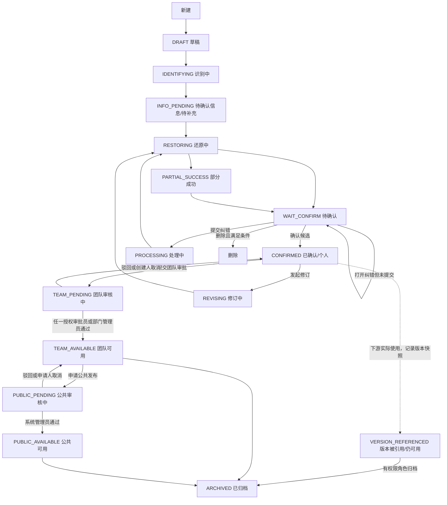
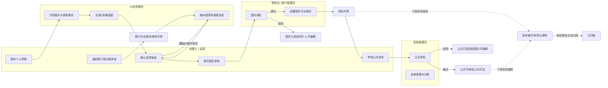
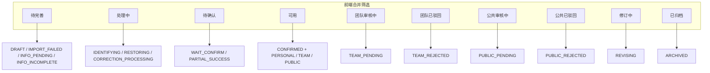
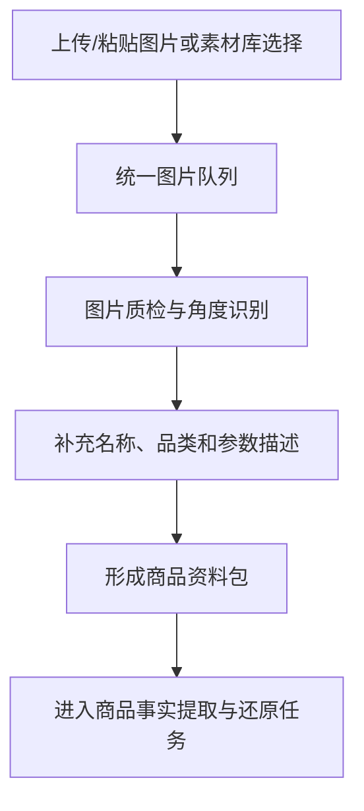
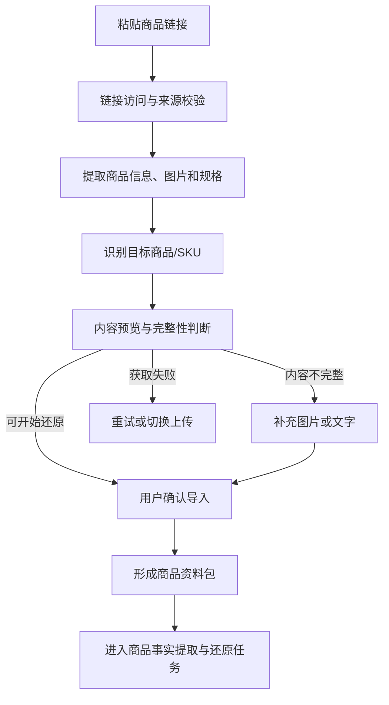
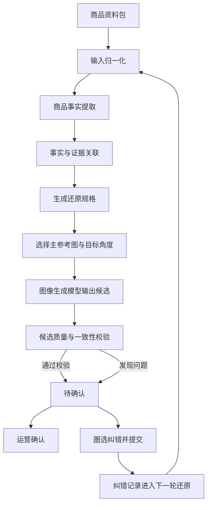

# 《先马 AI 设计平台｜商品智库｜MVP 完整 PRD》

## 0. 文档信息

| 项目 | 内容 |
|---|---|
| 所属平台 | 先马 AI 设计平台 |
| 所属模块 | 商品智库 |
| 需求类型 | 首次完整模块 PRD（基于已确认原型与规则） |
| 文档版本 | V1.2 |
| 文档状态 | 已确认业务规则，待技术评审与开发授权 |
| 创建日期 | 2026-09-04 |
| REQ需求来源 | 无独立 REQ；实际来源为用户已确认规则、商品学习与商品库 MVP 原型交接方案、当前前端原型，以及素材库/提示词库权限管理 PRD |
| 项目业务输入 | [需求入口](D:/HermesVault/10_先马电商/03_项目/01_先马AI设计平台/01_业务输入/需求入口.md) |
| 关键证据 | [商品学习与商品库 MVP 原型交接方案_260902](D:/HermesVault/10_先马电商/03_项目/01_先马AI设计平台/02_产品输出/AI商品智库/商品学习与商品库MVP原型交接方案_260902.md)；[素材库提示词库权限管理 PRD_260810](D:/HermesVault/10_先马电商/03_项目/01_先马AI设计平台/02_产品输出/资源管理与权限/素材库提示词库权限管理PRD_260810.md) |
| 对应原型 | `/products`、`/products/new`、`/products/[id]`；代码路径 `src/app/products/` |
| 原型事实版本 | 2026-09-04 本地前端交互原型；仅代表交互已验证，不代表后端、模型、商城 API、持久化、积分、部署或上线完成 |

### 变更摘要

1. 建立商品图片/文字资料、AI 识别、商品还原、运营确认、团队审批、公共审批的完整 MVP 闭环。
2. 统一收口“商品链路、状态、前端合并筛选、操作和权限”规则，作为开发和测试的单一业务引用章节。
3. 商品名称统一为“商品智库”；“AI 商品智库”仅保留历史记录，不作为当前界面文案。
4. 补充上传图片与链接导入两条资料获取链路，以及商品还原的底层处理、校验和纠错回流逻辑。

### 修订记录

| 版本 | 日期 | 变更内容 |
|---|---|---|
| V1.0 | 2026-09-04 | 首次完整模块 PRD，收口商品学习、确认、两级审批、状态和删除规则 |
| V1.1 | 2026-09-04 | 商品审批及可见组织调整复用平台公共组织选择组件，补充组件契约、权限边界、复用范围和验收标准 |
| V1.2 | 2026-09-04 | 明确原型角色切换与“导出 PRD”均为开发辅助能力，不纳入真实商品智库产品范围 |

## 1. 需求背景与目标

### 1.1 当前问题

平台已有素材、提示词、买家秀、主体替换等能力，但缺少经过运营确认的具体商品档案。AI 可能只保持品类或大致外观，却改变商品比例、分区、结构、材质、图案或功能部件，导致后续出图不可用。

### 1.2 本次目标

- 以多张商品图片和补充描述形成可核验的商品事实档案。
- 以标准商品还原候选图验证 AI 是否认识同一可售视觉 SKU。
- 通过运营确认、圈选纠错和补充资料完成可追溯迭代。
- 通过个人确认→团队审批→公共审批，将商品沉淀为可复用资产。

### 1.3 成功判断

- 用户可从新建入口完成资料提交、AI 输出、确认或纠错，并在离开后恢复。
- 团队和公共商品的可见范围由审批通过时明确设置，并受服务端权限约束。
- 任一关键商品身份错误不能被确认为可用商品；未提供的结构不会被当作已确认事实。
- 商品被下游任务实际使用后可追溯到使用时的商品版本，不能被删除。

## 2. 当前能力基线

| 编号 | 当前能力或规则 | 状态 | 事实来源 |
|---|---|---|---|
| BASE-01 | 素材库、提示词库、组织与资源权限原型已存在，平台身份为普通用户、部门管理员、审批员、系统管理员，可叠加 | 已确认 | 平台基线；素材库提示词库权限管理 PRD |
| BASE-02 | 当前代码已实现 `/products`、`/products/new`、`/products/[id]` 的前端交互原型和脱敏演示数据 | 当前原型 | 当前代码项目与 2026-09-04 验证记录 |
| BASE-03 | 商品名称当前展示统一为“商品智库” | 已确认 | 用户确认（2026-09-04） |
| BASE-04 | AI 输出完成进入“待确认”；运营确认不代表团队发布 | 已确认 | 用户确认规则、交接方案 V1.1 |
| BASE-05 | 商品库采用个人→团队→公共两级审批；公共审批仅系统管理员处理 | 已确认 | 用户确认规则、交接方案 V1.1 |
| BASE-06 | 前端状态使用合并筛选，底层状态保留用于任务、审计和异常处理 | 已确认 | 用户确认规则、交接方案 V1.1 |

### 已知原型差异

| 差异 | 正式规则 | 当前原型表现 | 本次是否处理 |
|---|---|---|---|
| 真实服务能力 | 原型不代表真实服务端能力 | 使用 `localStorage` 和演示数据 | 否，开发阶段另行接入 |
| 公共审批后的来源记录 | 业务是否长期保留团队视图来源记录尚未确认 | 当前保留同一商品记录 | 否，列为待确认 |
| 审批并行角色 | 任一有权限角色可处理即结束审批 | 当前原型按此演示 | 是，固化为已确认规则 |
| 原型角色切换 | 真实角色由登录账号和服务端权限计算 | 原型通过 `?role=` 参数切换普通用户、部门管理员、审批员和系统管理员视角 | 否，仅保留原型演示，不进入真实产品 |
| 原型导出 PRD | 正式产品无业务导出入口要求 | 当前原型提供标题区“导出 PRD”下载入口 | 否，仅供开发和评审下载当前 Markdown |

## 3. 本次范围

### 3.1 本次变更

| 编号 | 变更类型 | 变更内容 | 影响页面/区域 | 事实来源 |
|---|---|---|---|---|
| CHG-01 | 新增 | 商品智库入口、个人/团队/公共商品库列表 | `/products`、导航 | 用户确认、当前原型 |
| CHG-02 | 新增 | 上传图片、素材库选择、剪贴板粘贴、商品链接导入和参数描述 | `/products/new` 步骤 1 | 用户确认、当前原型 |
| CHG-03 | 新增 | 图片整理、信息覆盖、证据映射和商品还原 | `/products/new` 步骤 2～3 | 交接方案 |
| CHG-04 | 新增 | 待确认、候选确认、圈选纠错和重新还原 | `/products/new` 步骤 4、详情页 | 用户确认、交接方案 |
| CHG-05 | 新增 | 个人确认后提交团队审批，团队审批通过设置可见组织 | 列表、详情、审批弹窗 | 用户确认 |
| CHG-06 | 新增 | 团队商品申请公共发布，系统管理员公共审批 | 列表、详情、审批弹窗 | 用户确认 |
| CHG-07 | 新增 | 合并状态筛选、删除/归档边界、下游版本快照 | 列表、详情、下游接口 | 用户确认、交接方案 |
| CHG-08 | 规则补充 | 商品审批及可见组织调整复用公共组织选择组件 | 列表、详情、审批弹窗 | 用户确认、当前原型 |
| CHG-09 | 技术规则补充 | 上传图片与链接导入分链路处理，统一汇聚商品资料包并进入商品还原 | `/products/new` 步骤 1～4、还原任务 | 用户确认的链路方案、当前原型 |

### 3.2 本次不做

- 场景验证图、主体替换、AI 买家秀、AI 商品套图的下游接入。
- 商品专属模型训练、批量学习、商城自动发现/持续同步、SPU/SKU 复杂主数据体系。
- 固定正面/侧面/背面图片槽位或 360 度强制生成。
- 多级会签、复杂审批编排、自动选择审批人。
- 真实后端接口、模型效果、商城 API、积分计费和生产部署的承诺。

### 3.3 范围外产品建议

- 建议真实试点后再确定确认通过率、平均还原轮数和成本阈值；本期不写入目标数值。

## 4. 用户流程

### 4.1 前置条件

- 用户为有效账号；所有有效账号均可保存个人商品草稿。
- 进入团队审批前，商品必须有运营确认版本；用户需有有效所属组织。
- 团队审批和公共审批分别需要对应授权范围；服务端必须再次校验资源可见范围和角色。

### 4.2 主流程

1. 用户进入商品智库，点击“新建商品”。
2. 默认使用“上传商品图片”，也可切换为“粘贴商品链接”；两种入口共用图片队列、参数描述和后续步骤。
3. 用户补充图片和文字，系统整理图片、提取商品事实并标注信息覆盖情况。
4. 用户确认资料后启动商品还原，系统异步生成 2 张同角度候选图。
5. 候选完成后商品进入“待确认”。用户确认一张候选，或进入圈选纠错并提交新一轮还原，或删除符合条件的个人商品。
6. 确认后的商品仍属于创建人的个人范围；创建人提交团队审批。
7. 审批员或部门管理员审批团队发布，并在通过时设置最终团队可见组织；通过后进入团队商品库。
8. 团队商品由创建人或有权限团队管理员申请公共发布；系统管理员审批通过后进入公共商品库并全公司可见。

### 4.3 分支流程

- 链接导入与人工资料冲突：弹窗选择“替换当前内容”或“不替换，保留当前内容”；图片仍追加。
- 两张候选均不合格：圈选错误区域、选择问题类型、补充说明或图片，提交后进入“处理中”，新输出完成回到“待确认”。
- 审批驳回：保留驳回原因，商品回到发起审批前的范围，可修改后重新提交。
- 用户取消本人审批：回到发起前的范围；审批中不可直接编辑。
- 任务部分成功：保留成功候选，允许单独重试失败候选；业务商品仍展示为“待确认”。
- 商品已被下游实际使用：保存使用时商品版本快照，商品不得删除，只能归档。

## 5. 页面与交互变化

| 页面/区域 | 控件或内容 | 触发条件 | 用户操作 | 系统反馈 | 后续状态 |
|---|---|---|---|---|---|
| 商品库列表 | “我创建的/团队商品/公共商品”视图、搜索、品类和合并状态筛选 | 进入商品智库 | 切换视图或筛选 | 仅返回用户有权看到的资源 | 不改变商品状态 |
| 新建步骤 1 | 上传商品图片/粘贴商品链接切换、图片队列、参数描述 | 新建商品 | 上传、选择素材、粘贴图片或链接 | 所有来源进入共用资料区；冲突弹窗供用户选择 | 草稿或导入/识别中 |
| 新建步骤 2 | 信息覆盖情况、证据图片、编辑资料 | 识别完成 | 修改信息、确认 AI 推断、补图 | 标记已确认/AI 推断/待补充 | 待确认信息/待补充或可启动还原 |
| 新建步骤 3 | 还原进度、2 张候选图 | 资料确认 | 启动、离开、返回、终止 | 异步任务可恢复；失败保留输入 | 还原中、待确认或处理中 |
| 新建步骤 4/详情 | 候选图、AI 辅助检查、确认/圈选纠错/补充资料 | 有候选图 | 确认候选或提交纠错 | 记录确认人、候选、纠错证据和版本 | 已确认或处理中 |
| 列表/详情 | 团队审批、公共发布、取消、审批通过/驳回 | 命中角色和状态 | 提交、审批、取消或查看原因 | 二次确认、结果 Toast、审计记录 | 对应审核中/可用/已驳回 |
| 详情 | 发起修订、归档、调整团队可见组织 | 命中角色和状态 | 编辑修订或归档 | 原确认版本继续可见；归档保留历史 | 修订中或已归档 |

### 用户可见文案

| 场景 | 文案 | 展示方式 |
|---|---|---|
| 产品名称 | 商品智库 | 导航、页面标题 |
| 参数描述 | 商品参数与补充描述 | 多行输入框标题；不显示“选填”字样 |
| 参数示例 | `正面：新中式丝质款面料（有丝质的光泽感）` `背面：珊瑚绒亲肤面料` `尺寸：120cm*28cm（厚度为5cm），其中盐袋部分（65cm*28cm），两侧绑带分别长27.5cm` | 输入框 placeholder，三行展示 |
| 图片引导 | 建议补充正面、背面、侧面、展开图、结构细节、材质/花纹特写 | 上传区辅助文案；均为选填引导 |
| 资料不足 | 未看到商品背面，无法确认背面结构 | 信息覆盖提示 |
| 链接冲突 | 检测到链接资料与当前内容不一致，请选择是否替换 | 弹窗 |
| 冲突操作 | 替换当前内容 / 不替换，保留当前内容 | 弹窗按钮 |
| 删除限制 | 商品已被使用，无法删除；如需停止使用，请归档商品 | Toast/弹窗 |

## 6. 统一链路、状态与权限规则（单一业务引用章节）

> 本章节同时定义商品生命周期、前端合并筛选、状态可操作项和角色权限。开发、测试、设计不得从页面文案自行推导另一套状态。

### 6.1 状态流转图

### 6.1.1 业务阶段泳道图（角色与权限）

图中权限边界：创建人负责个人资料、确认和发起申请；AI 只负责识别与生成；团队审批由授权审批员或部门管理员处理，任一有权限角色处理即结束；公共审批仅系统管理员处理。审批中不允许直接编辑，驳回或取消后回到原范围。

### 6.1.2 前端筛选状态与底层状态关系图

前端只展示左侧合并状态；接口、任务、审计和数据存储使用右侧底层枚举。`PARTIAL_SUCCESS` 仍归入“待确认”，`确认不通过`不建立商品主状态；下游引用是删除限制标记，不自动改变“可用”状态。

### 6.2 状态定义、展示映射与操作

| 前端合并状态 | 底层枚举（建议命名，待技术确认） | 进入条件 | 页面可执行操作 | 禁止操作/退出条件 |
|---|---|---|---|---|
| 待完善 | `DRAFT`、`IMPORT_FAILED`、`INFO_PENDING`、`INFO_INCOMPLETE` | 新建未完成、导入失败、资料缺口待补充 | 继续编辑、补充资料、重试导入/识别、删除（个人未发布且未引用） | 任务进行中不可直接删除；完成资料后进入处理中/还原中 |
| 处理中 | `IDENTIFYING`、`RESTORING`、`CORRECTION_PROCESSING` | 识别、还原或纠错重试进行中 | 查看进度、离开后恢复、终止任务 | 不可直接编辑或删除；终止后回到待完善或待确认 |
| 待确认 | `WAIT_CONFIRM`、`PARTIAL_SUCCESS` | AI 输出完成或仅部分候选成功 | 确认候选、打开圈选纠错、补充资料、重试失败候选、删除（符合条件） | “确认不通过”不是状态；仅打开/取消纠错不改变状态 |
| 可用 | `CONFIRMED` + 范围为个人/团队/公共 | 运营确认候选或审批通过 | 个人提交团队审批；团队申请公共发布；有权修订、调整范围、归档；下游选择使用 | 审批中不可直接编辑；有确认版本的商品不可删除 |
| 团队审核中 | `TEAM_PENDING` | 创建人提交团队审批 | 查看进度、创建人取消申请 | 审批中不可编辑；通过或驳回后退出 |
| 团队已驳回 | `TEAM_REJECTED` | 团队审批驳回 | 查看原因、修改后重新提交 | 不可直接进入团队库；重新提交前须回到个人可编辑范围 |
| 公共审核中 | `PUBLIC_PENDING` | 团队商品申请公共发布 | 查看进度、申请人取消 | 审批中不可编辑；仅系统管理员处理审批 |
| 公共已驳回 | `PUBLIC_REJECTED` | 公共审批驳回 | 查看原因、修改后重新提交公共发布 | 不得标为公共可用 |
| 修订中 | `REVISING` | 已确认商品发起新修订 | 编辑修订资料、重新还原、确认新版本 | 原确认版本继续有效；不可删除 |
| 已归档 | `ARCHIVED` | 有权管理员归档或被引用版本停止正常使用 | 查看历史、审计和版本 | 不进入正常选择入口；不可修改、删除或重新发布 |

### 6.3 范围与审批链路

| 阶段 | 商品范围 | 发起/处理角色 | 通过后的可见范围 | 审批规则 |
|---|---|---|---|---|
| 个人确认 | 个人 | 创建人或系统管理员确认 | 仅创建人个人库 | 确认只代表还原质量，不增加团队可见性 |
| 团队审批 | 个人待提交 | 创建人提交；审批员或部门管理员处理授权范围内申请 | 审批通过时由处理人设置最终团队可见组织 | 审批员与部门管理员均命中时，任一有权限角色处理即结束审批；该规则已确认 |
| 团队可用 | 团队 | 创建人或有权限团队管理员申请公共发布 | 当前团队可见组织 | 审批通过后才进入团队商品库；创建人不能绕过审批直接发布 |
| 公共审批 | 团队待发布 | 系统管理员处理 | 通过后全公司有效账号可见 | 仅系统管理员可通过/驳回；团队管理员和审批员无公共审批权 |
| 公共可用 | 公共 | 系统管理员管理 | 全公司有效账号 | 公共商品固定全公司可见，不再设置组织选择器 |

### 6.3.1 可见组织选择组件契约

- 商品团队审批通过和后续调整团队可见组织时，统一复用平台公共“可见组织”选择组件；素材库、提示词库的同类审批/编辑入口使用相同交互契约。
- 组件提供组织名称搜索、组织树展开/收起、父组织选择包含当前及全部下级组织、子组织继承态展示，以及无匹配结果和无可选组织的反馈。
- 组件仅负责展示授权组织树、维护本次选择值和返回选择结果；商品页面仍负责角色权限判断、审批状态判断、审批通过/保存提交和成功/失败反馈。
- 可选组织必须受当前操作人的授权范围限制；超出范围的组织不可见或不可选，前端限制不能替代服务端对角色、审批事项、资源范围和账号状态的最终校验。
- 团队审批通过时至少选择一个最终可见组织；公共商品固定全公司可见，不展示组织选择器，也不允许通过该组件缩小公共范围。
- 商品档案继续沿用 `team_org_ids` 保存团队可见组织，本次不新增独立组织数据对象或第二套组织范围算法。
- `/admin/permission` 的主管默认组织、部分选中和角色联动树属于权限管理专用组件，本次不与资源可见组织组件合并。

### 6.4 角色权限矩阵

| 操作 | 普通用户 | 部门管理员 | 审批员 | 系统管理员 |
|---|---|---|---|---|
| 进入商品智库/查看公共商品 | 可以 | 可以 | 可以 | 可以 |
| 查看本人草稿、学习记录 | 本人 | 本人 | 本人 | 全部 |
| 创建、上传、导入、纠错 | 本人商品 | 本人商品 | 本人商品 | 任意商品 |
| 确认还原结果 | 本人商品 | 本人商品 | 本人商品 | 任意商品 |
| 查看团队商品 | 命中可见组织 | 命中可见组织或管理范围 | 命中可见组织 | 全部 |
| 提交本人商品团队审批 | 可以 | 可以 | 可以 | 可以 |
| 审批团队商品 | 不可以 | 授权管理范围 | 授权审批范围 | 全部 |
| 申请公共发布 | 本人创建的团队商品 | 管理范围内团队商品 | 不可以 | 可以 |
| 审批公共发布 | 不可以 | 不可以 | 不可以 | 可以 |
| 调整团队可见组织 | 不可以 | 管理组织范围内 | 不可以 | 全公司 |
| 编辑团队商品 | 不可以直接覆盖；发起修订 | 管理范围内发起修订 | 不因审批获得编辑权 | 全部 |
| 归档团队/公共商品 | 不可以 | 管理范围内团队商品 | 不可以 | 全部 |
| 删除个人商品 | 创建人本人，且未发布未引用 | 本人商品；系统管理员可全局 | 本人商品；系统管理员可全局 | 任意未发布未引用商品 |
| 查看审计 | 不可以 | 不可以 | 不可以 | 可以 |

补充规则：钉钉主管只是同步标识，不单独授予商品权限；账号停用后立即失去访问和操作能力；无有效所属组织的用户可保存个人草稿但不能提交团队审批；无权访问时列表、详情、图片和接口均不泄露资源是否存在。

### 6.5 修改、删除、归档与版本快照

- 审批中不可直接编辑；创建人可取消本人发起的申请，驳回或取消后回到原范围再修改。
- 已确认团队商品通过“发起修订”生成修订草稿，原确认版本在新版本确认前继续可见。
- 仅创建人或系统管理员可删除未发布、未被下游实际使用的个人商品；允许删除的业务状态为待完善、待确认（含部分成功）。
- 识别中、还原中或纠错处理中须先终止任务，终止后再判断是否可删除。
- 已确认商品、团队/公共商品、修订中、已归档或已被下游引用的商品不可删除，只能按权限归档。
- 买家秀、商品套图等下游任务实际提交后记录商品版本快照（商品事实、确认图、版本号、使用时间和任务标识）；后续商品修订不改变历史任务引用。

## 7. 功能规则

### R-01 商品粒度与资料

- **规则状态**：已确认。一个商品档案代表一个视觉 SKU；颜色、花型、外形或结构不同分别建档；仅尺寸不同且外观结构完全一致时共用档案。
- 图片至少一张能看清完整外形即可继续；正面、背面、侧面、展开、结构细节、材质/花纹特写均为选填引导，不设置固定槽位。
- “商品参数与补充描述”为单个多行选填字段，仅作参考，不拆分动态参数字段，不阻断流程。

### R-02 图片与链接输入

- **规则状态**：已确认。支持素材库选择、本地上传和剪贴板粘贴 JPG/PNG/WEBP 图片；剪贴板图片单张不超过 20MB（技术上限待确认）。
- 上传图片与链接导入图片进入同一队列；链接图片追加不替换已有图片。链接与人工文字冲突时由用户选择替换或保留。
- 链接导入失败保留链接和已有输入，可重试或切换上传；不做自动抓取、批量导入或持续同步。

### R-03 商品事实与还原

- **规则状态**：已确认。AI 分类、去重、提取商品事实并关联图片证据，信息分为已确认、AI 推断、待补充。
- 未提供或无法确认的背面、内部、底部、隐藏部件不得推测补全；资料缺口不强制阻断，但必须说明影响。
- 每轮输出 2 张同角度标准候选图，沿用证据最完整角度；白色或中性背景，不添加人物、场景、文字、装饰或无关道具。
- 硬性一致项包括商品类型/形态、比例、部件与分区、功能结构、主色/关键配色、固定标识和核心图案；任一关键错误不能确认。轻微色差、光泽、自然褶皱和不影响身份的小装饰可人工复核。

### R-04 运营确认与纠错

- **规则状态**：已确认。AI 输出完成进入“待确认”；运营拥有最终确认权，AI 自检仅作辅助。
- 确认候选后记录确认图、确认人和时间，商品进入个人“可用”，不自动进入团队商品库。
- 圈选纠错未提交时不改变状态；提交后进入“处理中”，重新输出完成回到“待确认”。“确认不通过”不是商品主状态。
- 纠错保留原始资料、候选图、圈选区域、问题类型、补充说明/图片和每轮版本。

### R-05 两级审批

- **规则状态**：已确认。创建人主动提交团队审批；审批通过时由处理人设置最终团队可见组织。
- 审批员和部门管理员按授权组织处理团队审批；任一有权限角色处理即结束审批。审批通过进入团队商品库，驳回需保留原因。
- 团队商品申请公共发布；公共审批仅系统管理员处理，通过后固定全公司可见。

### 7.1 图片上传链路

- 本地上传、剪贴板粘贴和素材库选择的图片进入同一图片队列，沿用现有去重、预览、排序、删除和角度提示规则。
- 系统对图片执行格式/可读性、重复、主体存在性和角度识别；买家秀或场景图可以作为辅助证据，但不能替代完整商品外观图。
- 至少一张能看清完整商品外形的图片时，允许形成商品资料包并启动后续识别；缺少背面、内部、尺寸等信息时记录资料缺口，不自动补全。
- 商品名称、品类和“商品参数与补充描述”由用户填写；参数描述为选填，不因未填写阻断流程。

### 7.2 链接导入链路

- 链接导入必须先执行获取预检，不因“页面可打开”直接判定为资料可用。
- 预检需要确认链接对应正确商品和目标 SKU，并提取名称、品类、商品图、角度、结构、颜色/花纹、材质和页面明确展示的参数。
- 多颜色、多规格或多 SKU 时，必须让用户选择目标 SKU；无法确认目标时不能直接启动还原。
- 页面图片分为主还原证据、辅助场景参考和无关图片；只有场景图或无法看清商品主体时，不得判定为可开始还原。
- “可开始还原”的最低条件为：目标商品/SKU 明确、名称和品类明确、至少一张完整商品外观图可用。尺寸、面料等非必要资料缺失时显示资料缺口，允许用户补充后继续。
- 链接获取结果分为“可开始还原”“内容不完整”“获取失败”三种前端展示状态。获取失败包括链接不可访问、目标商品不匹配、无有效商品图或 SKU 无法判断。
- 链接识别结果必须先进入预览，由用户确认导入；与人工名称、品类或参数冲突时，弹窗提供“替换当前内容”和“不替换，保留当前内容”，图片仍按现有规则追加到共用队列。
- 链接导入失败时保留链接和已有人工资料，允许重试或切换到上传图片，不丢失已有资料。

链接获取底层状态建议与前端展示映射如下（枚举为建议命名，待技术确认）：

| 底层枚举 | 前端展示 | 进入条件 | 是否允许进入商品还原 |
|---|---|---|---|
| `NOT_STARTED` | 未开始 | 尚未提交链接预检 | 否 |
| `FETCHING` | 获取中 | 正在访问页面和提取内容 | 否 |
| `READY` | 可开始还原 | 目标商品/SKU、名称、品类和至少一张完整商品图明确 | 是，需用户确认导入 |
| `PARTIAL` | 内容不完整 | 商品可确认但缺少非必要图片、结构或参数 | 补充后可进入；未补充时仍可保存资料 |
| `FAILED` | 获取失败 | 无法访问、商品不匹配、无有效商品图或 SKU 无法判断 | 否 |

## 8. 状态、边界与异常

### 8.1 任务状态

| 任务状态 | 枚举标识（建议命名，待技术确认） | 处理规则 |
|---|---|---|
| 排队中 | `QUEUED` | 输入已保存，等待执行；允许离开页面 |
| 处理中 | `RUNNING` | 展示进度；允许查看/终止，禁止并行覆盖同一轮 |
| 成功 | `SUCCEEDED` | 保留全部结果；商品进入待确认 |
| 部分成功 | `PARTIAL_SUCCESS` | 保留成功图，失败项单独重试；商品仍展示待确认 |
| 失败 | `FAILED` | 保留输入和已完成资料；允许重试，不要求重新建档 |
| 已取消 | `CANCELLED` | 保留输入和历史；允许再次提交 |

### 8.2 边界

| 边界场景 | 处理规则 | 用户反馈 |
|---|---|---|
| 无图片 | 不允许启动识别/还原 | 提示至少添加一张完整商品图 |
| 仅一张完整图 | 允许继续 | 明确展示无法确认的角度/结构 |
| 重复或无关图片 | AI 标记，用户确认后移除 | 显示具体图片和原因 |
| 多个视觉 SKU | 只选择一个创建档案 | 提供 SKU/图片选择 |
| 剪贴板非图片、格式不符或超 20MB | 不加入队列，保留现有资料 | 提示支持的格式和大小 |
| 文字输入框聚焦时粘贴文字 | 按正常文字粘贴，不拦截 | 无额外提示 |
| 链接识别字段冲突 | 弹窗选择替换或保留 | 图片仍追加到队列 |
| 审批中编辑/删除 | 禁止操作 | 显示当前审批状态和可用取消入口 |

### 8.3 异常

| 异常场景 | 已产生的数据 | 用户可执行操作 | 积分/历史影响 |
|---|---|---|---|
| 网络中断/用户离开 | 保留草稿和任务状态 | 返回列表继续处理 | 沿用平台现有积分与历史规则；扣费边界待技术确认 |
| 单项失败 | 保留成功候选与失败原因 | 重试失败项 | 历史保留每次任务；扣费规则待确认 |
| 全部失败 | 保留输入、资料和失败记录 | 重试或修改资料后重试 | 沿用平台现有逻辑；失败退费待确认 |
| 任务终止 | 保留输入和取消记录 | 再次提交 | 沿用平台现有逻辑 |
| 并发修改 | 以最新有效版本为准 | 刷新后重试 | 不静默覆盖；审计记录冲突 |
| 账号停用/组织失效 | 不删除已确认商品 | 系统管理员处理范围 | 访问立即收回；历史不级联删除 |

### 8.4 商品还原底层处理逻辑

1. **输入归一化**：合并上传、剪贴板、素材库和链接导入的图片及文字，保留来源、顺序、角度标签和用户确认结果；去重和无关图标记不删除原始证据。
2. **商品事实提取**：多模态模型从图片和补充描述中提取商品形态、比例、部件/分区、功能结构、主色、材质和关键图案，并为每项事实关联证据图片。事实分为“已确认”“AI 推断”“待补充”；模型不得把未展示的背面、内部或隐藏结构写成已确认事实。
3. **还原规格生成**：系统将已确认事实、允许使用的 AI 推断、人工补充描述、主参考图、目标角度、背景要求和禁止项整理为本轮任务的结构化约束。人工不需要手写模型提示词。
4. **候选生成**：图像生成服务基于参考图和还原规格生成 2 张同角度候选图；默认使用白色或中性背景，不主动加入人物、场景、文字、装饰或无关道具。具体模型、参数和服务编排由技术方案确定。
5. **自动校验**：系统对候选图执行商品主体存在、完整入镜、构图/角度、轮廓比例、部件分区、主色/关键配色、图案和明显虚构部件检查。自动校验仅提供问题提示，不替代运营最终确认；部分候选成功时保留成功图并允许单项重试。
6. **人工确认与纠错**：候选完成后进入“待确认”。运营选择候选即固化个人确认版本；圈选错误区域、选择问题类型并提交后进入“处理中”，系统把纠错信息作为下一轮约束，重新输出完成后回到“待确认”。仅打开或取消纠错不改变商品状态。
7. **版本与审计**：每轮保存输入资料包、事实及证据、还原规格、参考图、模型/服务版本、候选图、自动校验结果、人工确认或纠错记录和时间；下游实际使用时沿用确认版本快照。

底层处理必须支持排队、处理中、成功、部分成功、失败、取消、离开后恢复和重试；任务状态沿用 8.1 枚举，商品主状态按 6.2 映射，不因自动校验失败新增商品主状态。

## 9. 数据结构与公共能力影响

### 9.1 关键数据结构

以下为业务传递所需字段；物理表名、接口字段名、长度、索引和存储方案均需技术评审确认。

| 对象 | 字段名 | 类型 | 必填 | 长度/范围 | 默认值 | 格式/枚举 | 校验规则 | 说明 |
|---|---|---|---|---|---|---|---|---|
| 商品档案 | `product_id` | 字符串 | 是 | 待技术确认 | 系统生成 | 全局唯一 | 不可重复 | 统一资源 ID |
| 商品档案 | `name` | 字符串 | 是 | 待技术确认 | 无 | UTF-8 | 去除首尾空格 | 商品名称 |
| 商品档案 | `category_id` | 字符串/空 | 否 | 沿用品类结构 | 空 | 现有品类枚举 | 需有权访问 | 沿用平台现有品类 |
| 商品档案 | `visual_sku_key` | 字符串 | 是 | 待技术确认 | 系统生成 | 视觉 SKU 标识 | 同一档案唯一 | 不新增 SKU 主数据树 |
| 商品档案 | `description` | 字符串 | 否 | 待技术确认 | 空 | 多行文本 | 仅保存文字，不阻断 | 商品参数与补充描述 |
| 商品档案 | `link_url` | 字符串 | 链接导入时是 | 待技术确认 | 空 | URL | 仅保存合规来源链接，访问权限受服务端控制 | 链接来源 |
| 商品档案 | `link_fetch_status` | 枚举 | 链接导入时是 | - | `NOT_STARTED` | `NOT_STARTED/FETCHING/READY/PARTIAL/FAILED` | 按链接预检规则转移 | 链接获取结果，建议命名，待技术确认 |
| 商品档案 | `scope` | 枚举 | 是 | - | `PERSONAL` | `PERSONAL/TEAM/PUBLIC` | 与审批状态一致 | 资源可见范围 |
| 商品档案 | `team_org_ids` | 字符串数组 | 团队时是 | 待技术确认 | 空 | 组织 ID 列表 | 仅审批人/管理员可写 | 团队最终可见组织 |
| 商品档案 | `product_status` | 枚举 | 是 | - | `DRAFT` | 见 6.2 | 状态转移受权限和前置条件约束 | 建议命名，待技术确认 |
| 图片证据 | `image_id` | 字符串 | 是 | 待技术确认 | 系统生成 | 全局唯一 | 不重复引用 | 原始/补充图片 |
| 图片证据 | `source_type` | 枚举 | 是 | - | 无 | `ASSET/UPLOAD/CLIPBOARD/LINK` | 仅允许支持来源 | 图片来源 |
| 图片证据 | `angle_type` | 枚举/空 | 否 | - | 空 | 正面/背面/侧面/展开/细节/材质/其他 | 可人工修正 | 角度标签，不是必填槽位 |
| 商品事实 | `fact_items` | 对象数组 | 是 | 待技术确认 | 空 | `CONFIRMED/INFERRED/MISSING` | 每项可关联证据 | 商品事实及覆盖状态 |
| 还原任务 | `restoration_spec` | 对象 | 是 | 待技术确认 | 空 | 结构化约束对象 | 必须引用事实和参考图 | 本轮还原规格，具体子字段待技术确认 |
| 还原任务 | `task_id` | 字符串 | 是 | 待技术确认 | 系统生成 | 全局唯一 | 幂等提交 | 异步任务 |
| 还原任务 | `task_status` | 枚举 | 是 | - | `QUEUED` | 见 8.1 | 受任务状态机约束 | 建议命名，待技术确认 |
| 还原结果 | `result_id` | 字符串 | 是 | 待技术确认 | 系统生成 | 全局唯一 | 归属任务 | 单张候选图 |
| 还原结果 | `version_no` | 整数 | 是 | 正整数 | 1 | 版本号 | 同一商品递增 | 确认/修订版本 |
| 下游引用 | `usage_id` | 字符串 | 实际使用后是 | 待技术确认 | 系统生成 | 全局唯一 | 仅提交任务时创建 | 下游模块、任务和快照 |
| 审批记录 | `approval_type` | 枚举 | 是 | - | 无 | `TEAM/PUBLIC` | 与 scope 匹配 | 两级审批 |
| 审批记录 | `decision` | 枚举 | 是 | - | 无 | `APPROVED/REJECTED/CANCELLED` | 记录处理角色 | 审批结果 |
| 审计记录 | `action` | 枚举 | 是 | 待技术确认 | 无 | 创建/确认/纠错/审批/范围变更/归档/拒绝 | 不可由前端伪造 | 沿用平台审计能力 |

### 9.2 公共能力与依赖

| 项目 | 是否影响 | 依赖的现有能力 / 对接方式 | 具体影响或无影响依据 |
|---|---|---|---|
| 输入数据与校验 | 是 | 复用现有上传、素材选择和图片预览能力；新增商品资料对象 | 增加来源互补、角度提示和参数描述 |
| 素材库 | 是 | 复用素材库选择器；商品原图可引用但不复制为新素材 | 需校验来源权限和图片可读性 |
| 历史记录与参数恢复 | 是 | 沿用平台历史任务存储/恢复逻辑 | 增加商品版本、纠错记录和审批记录关联 |
| 已有任务/历史数据 | 是 | 沿用现有任务状态和历史兼容策略 | 新模块不改写旧任务；下游使用需保存商品版本快照 |
| 权限与账号范围 | 是 | 复用组织同步、角色底座和服务端鉴权 | 新增商品范围、两级审批和单条资源可见性 |
| 积分与计费 | 是 | 沿用平台现有扣费框架 | 每轮 2 张候选、失败/部分成功/重试退费规则待技术确认 |
| 下载与文件 | 是 | 复用现有图片预览/下载能力 | 原图、候选图和确认图按现有文件策略处理 |
| 外部平台、授权与审计 | 是 | 商品链接依赖既定商城 API；复用平台审计 | API 平台、字段、认证、限流和数据边界待技术核验 |
| 下游模块 | 是（本期只预留） | 预留买家秀、商品套图、主体替换的商品选择和快照接口 | 本期不接入主流程，不宣称质量提升 |
| 图像生成与校验服务 | 是 | 复用平台模型调用、异步任务、文件和历史能力；以模型适配层接入生成与一致性校验 | 本期锁定输入、输出、校验和回流契约；具体模型、参数、阈值、超时和服务编排待技术方案确认 |
| 可见组织选择组件 | 是 | 复用平台公共组织选择组件；业务页传入当前授权范围并接收选择结果 | 商品、素材、提示词保持一致交互；不改变角色授权、审批流或服务端最终校验 |
| SPA / 独立页面同步 | 否 | 当前商品原型为 Next 路由页面 | 无独立 HTML 商品页；若新增需重新评估 |

## 10. 非功能与约束

| 维度 | 本次要求 | 事实来源 / 状态 |
|---|---|---|
| 数据保留 | 原始证据、确认版本、审批、纠错、引用和审计需可追溯；具体保留周期待确认 | 已确认保留内容；周期待技术确认 |
| 任务超时与失败 | 必须支持排队、处理中、成功、部分成功、失败、取消、重试；具体超时待确认 | 已确认行为；数值待确认 |
| 并发与队列 | 同一商品不得发生静默覆盖；同一用户多任务并行上限和队列策略待确认 | 已确认冲突原则；参数待确认 |
| 性能预期 | 提交后需立即反馈任务已创建或失败原因；生成耗时不承诺固定数值 | 已确认交互；耗时待确认 |
| 兼容范围 | 桌面、1280px、1024px 和窄屏；弹窗正文独立滚动且不被侧栏裁切 | 当前 UI 规范与原型验收 |
| 数据安全 | 图片、文字和组织范围按资源权限校验；第三方模型传输边界需审批 | 已确认边界；技术/安全待核验 |

## 11. 验收标准

| 编号 | 关联变更/规则 | 前置条件 | 操作步骤 | 预期结果 | 类型 |
|---|---|---|---|---|---|
| AC-01 | CHG-01/R-05 | 有效普通用户 | 进入商品智库并切换三个视图 | 仅展示有权资源；名称为“商品智库” | 正常 |
| AC-02 | CHG-02/R-02 | 新建商品 | 分别上传本地图片、选择素材、粘贴图片并切换链接入口 | 所有图片进入同一队列；切换不清空资料 | 正常 |
| AC-03 | CHG-02/R-01 | 新建商品 | 不填写参数描述，仅添加一张完整外观图并继续 | 参数描述不阻断；页面提示资料缺口 | 边界 |
| AC-04 | CHG-02/R-02 | 已有人工名称/参数 | 导入冲突链接并选择“保留当前内容” | 人工文字保留，链接图片仍追加 | 正常 |
| AC-05 | CHG-03/R-03 | 图片资料已提交 | 查看 AI 识别结果和证据 | 每项信息有已确认/AI 推断/待补充标识及证据；未知结构不被补全 | 正常 |
| AC-06 | CHG-04/R-04 | 还原任务完成 | 查看两张候选并确认其中一张 | 商品进入个人“可用”，不直接进入团队商品库 | 正常 |
| AC-07 | CHG-04/R-04 | 候选均不合格 | 打开纠错后直接取消 | 商品仍为待确认；未提交不产生处理中状态 | 边界 |
| AC-08 | CHG-04/R-04 | 候选均不合格 | 圈选区域、选择问题类型并提交 | 商品进入处理中；新输出完成后回到待确认；旧记录保留 | 正常 |
| AC-09 | CHG-05/R-05 | 已确认个人商品，有有效组织 | 创建人提交团队审批 | 商品为团队审核中，审批中不可编辑，创建人可取消 | 正常 |
| AC-10 | CHG-05/R-05 | 团队审核中 | 审批员和部门管理员均命中权限时由任一角色处理 | 一次处理即结束审批；通过时可见组织被保存 | 正常 |
| AC-11 | CHG-06/R-05 | 团队可用商品 | 创建人申请公共发布，系统管理员审批通过 | 商品进入公共可用；非原团队成员的有效账号可查看 | 联动 |
| AC-12 | CHG-05/CHG-06 | 审批中商品 | 普通用户尝试编辑或删除；创建人取消审批 | 前者被拒绝并不泄露资源；取消后回到原范围可修改 | 权限/异常 |
| AC-13 | CHG-07 | 个人待确认商品，无下游引用 | 创建人删除 | 商品从正常列表移除；删除前有二次确认 | 正常 |
| AC-14 | CHG-07 | 商品已有下游实际使用引用 | 尝试删除并归档 | 删除被拒；允许有权角色归档；历史任务仍引用原版本快照 | 联动 |
| AC-15 | CHG-07/R-04 | 仅一张候选成功 | 查看结果并重试失败候选 | 成功图保留，失败项单独重试，商品仍为待确认 | 异常 |
| AC-16 | CHG-02 | 文字输入框聚焦或剪贴板图片超限 | 粘贴文字、非图片或超过 20MB 图片 | 文字正常粘贴；不合格图片不入队且现有资料不丢失 | 边界 |
| AC-17 | CHG-03/CHG-04 | 任务处理中 | 离开页面、返回、终止任务 | 任务状态可恢复；终止后保留输入并可再次提交 | 异常 |
| AC-18 | CHG-05/CHG-06 | 无所属组织或账号已停用 | 尝试团队审批/访问公共商品 | 无组织只能保存个人草稿；停用账号立即无权访问和操作 | 权限 |
| AC-19 | CHG-07 | 已确认团队商品 | 创建人发起修订并修改资料 | 产生修订中草稿；旧确认版本继续可见且不可被覆盖 | 版本 |
| AC-20 | CHG-01/CHG-07 | 桌面及窄屏视口 | 在 1440px、1280px、1024px、390px 验证列表、详情、弹窗 | 无横向溢出、遮挡或不可达操作；弹窗正文可独立滚动 | 兼容 |
| AC-26 | CHG-09 | 上传图片或选择素材库图片 | 添加一张完整商品外观图并补充文字 | 图片、来源、角度和文字进入同一商品资料包，可启动事实提取 | 正常 |
| AC-27 | CHG-09 | 链接可访问且页面为单一目标商品 | 执行链接预检并查看导入预览 | 页面展示商品名称、品类、图片和已识别参数；用户确认后才进入商品资料包 | 正常 |
| AC-28 | CHG-09 | 链接可访问但存在多个 SKU | 执行链接预检 | 系统列出 SKU/颜色/规格供选择；未选择前不能启动还原 | 边界 |
| AC-29 | CHG-09 | 链接能获取商品但缺少部分参数或角度 | 查看预检结果并补充资料 | 显示“内容不完整”和资料缺口；允许补充后继续，不能把缺失信息标为已确认 | 边界 |
| AC-30 | CHG-09 | 链接不可访问、商品不匹配或只有场景图 | 执行链接预检 | 显示“获取失败”；保留链接和已有资料，可重试或切换上传，不启动还原 | 异常 |
| AC-31 | CHG-09 | 链接识别结果与人工名称/参数冲突 | 选择“替换当前内容”或“不替换，保留当前内容” | 按选择处理文字；链接图片按规则追加，已有资料不丢失 | 冲突 |
| AC-32 | CHG-09 | 商品资料包已形成 | 启动还原并查看候选 | 系统先提取事实并关联证据，再生成结构化还原规格；候选为 2 张同角度标准图 | 正常 |
| AC-33 | CHG-09 | 候选图包含结构或比例错误 | 查看自动校验并进入纠错 | 校验列出问题但不自动确认；运营可圈选并提交，任务进入处理中，下一轮完成后回到待确认 | 纠错 |
| AC-34 | CHG-09 | 输入未提供背面/内部结构 | 启动还原并查看事实与候选 | 未提供的信息标记待补充；系统不得将其写成已确认事实或擅自补全 | 安全/质量 |
| AC-21 | CHG-08 | 商品团队审批或调整团队可见组织 | 搜索组织、展开/收起树并选择父组织 | 组织树交互与素材库、提示词库一致；选择父组织后下级呈继承态并返回正确选择值 | 正常 |
| AC-22 | CHG-08 | 操作人仅有部分授权组织 | 搜索并尝试选择授权范围外组织 | 范围外组织不展示或不可选；服务端再次校验，不能通过前端绕过权限 | 权限/安全 |
| AC-23 | CHG-08 | 团队审批通过、公共审批通过 | 分别打开审批弹窗 | 团队审批必须选择至少一个可见组织；公共审批不显示组织选择器且通过后全公司可见 | 边界 |
| AC-24 | CHG-08 | 商品、素材、提示词三类业务入口 | 分别打开审批/编辑的可见组织区域 | 三处使用一致的搜索、树操作、继承态和空状态；业务页面仍保留各自状态与提交权限 | 跨模块 |
| AC-25 | CHG-08 | 无匹配组织或无可选组织 | 搜索不存在的组织或打开空授权范围 | 显示明确空状态，不允许提交空的团队可见范围 | 空状态 |

## 12. 待确认项与建议项

### 待确认项

| 编号 | 问题 | 可选方案 | 不确认的影响 | 负责人/状态 |
|---|---|---|---|---|
| TBD-01 | 公共审批通过后，团队视图是否长期保留“公共已发布”来源记录 | A 保留同一资源来源记录（当前原型） / B 团队视图移除但公共视图保留 | 影响列表筛选、来源展示和验收 | 待业务确认 |
| TBD-02 | 商品图片数量、单图大小、生成超时、并发队列上限 | 沿用平台配置 / 技术评审后定值 | 影响接口校验、任务调度和容量 | 待技术确认 |
| TBD-03 | 每轮 2 张候选的积分扣减、失败退回、部分成功和重试计费 | 沿用平台积分框架并补商品任务规则 | 影响计费、异常验收和用户提示 | 待产品/技术确认 |
| TBD-04 | 商城链接 API 支持平台、字段、认证、限流和数据使用边界 | 技术核验后确定支持范围 | 影响链接导入是否可交付 | 待技术/安全确认 |
| TBD-05 | 商品历史版本数量、归档保存周期与恢复能力 | 沿用平台历史策略或单独设定 | 影响存储、审计和恢复验收 | 待技术确认 |
| TBD-06 | 商品还原模型、模型调用方式、自动校验模型、阈值、超时和失败退费 | 由技术方案评审确定；本 PRD 先锁定输入、输出、校验、人工确认和版本留痕契约 | 影响模型接入、任务调度、质量门槛和成本 | 待技术确认 |

### 建议项（不纳入本期范围）

- 真实试点后再设确认通过率、确认时长、纠错轮数和成本目标。
- 在商品快照稳定后，再接入主体替换作为第一个下游质量验证场景。

## 13. 开发交付边界

- 本 PRD 已确认业务规则，不等于后端或生产开发授权；开发前须完成技术方案、接口/数据表、模型能力、商城 API、积分和安全评审。
- 物理表名、API URL、具体模型、错误码和性能数值不得从本 PRD推断；技术确认后补充开发设计文档。
- 前端原型仅用于交互验收，演示数据与真实数据必须隔离；不得把原型按钮视为已接通服务。
- 商品库原型中的角色切换控件和 URL `?role=` 参数仅用于模拟不同角色视角；真实项目由登录身份、组织同步和服务端授权返回角色与数据范围，用户不得在商品页面自行切换角色。
- 原型标题区“导出 PRD”仅为开发和评审下载当前 Markdown 的辅助入口，不属于商品智库业务功能、角色权限或正式产品验收范围；正式项目是否保留由平台开发规范另行决定。
