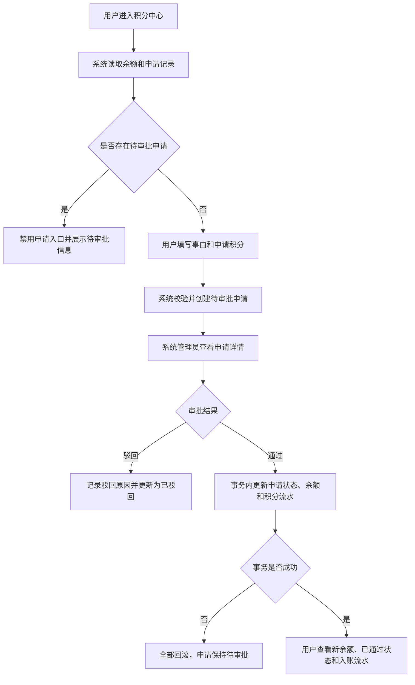

# 《先马AI内容与视觉平台—积分申请与审批模块 PRD》

## 0. 文档信息

| 项目 | 内容 |
|---|---|
| 所属平台 | 先马AI内容与视觉平台 |
| 所属模块 | 积分中心 / 积分审批 |
| 文档类型 | 完整模块 PRD |
| 文档状态 | 产品范围已确认，后端接入项待技术确认 |
| 文档版本 | V1.0 |
| 编写日期 | 2026-08-03 |
|  | |

### 0.1 变更摘要

1. 将原钉钉积分申请流程迁入先马AI内容与视觉平台，形成申请、审批、入账和流水闭环。
2. 首期仅系统管理员审批；审批通过后自动增加用户积分。
3. 当前前端原型中的本地演示状态需替换为真实登录用户、权限、积分账户、审批事务和持久化接口。

## 1. 需求背景与目标

### 1.1 当前问题

当前用户积分不足时通过钉钉发起申请，审批通过后仍需人工进入系统新增积分。申请、审批和积分入账分散在不同系统，存在以下问题：

- 申请人需要离开 AI 设计平台，入口不集中。
- 审批结果与积分余额不联动，管理员需要二次人工操作。
- 人工入账容易出现漏加、重复加或金额不一致。
- 申请记录、审批记录与积分流水无法通过同一申请单追溯。

### 1.2 模块目标

- 用户可在先马AI内容与视觉平台内查看余额并提交积分申请。
- 系统管理员可在管理后台处理申请。
- 审批通过后，系统自动且仅一次增加对应积分。
- 申请、审批、余额变更和积分流水可关联追溯。
- 为后续接入组织权限和部门审批预留明确边界，但首期不实现。

### 1.3 成功判断

- 用户可以完成一次有效积分申请，并查看处理状态。
- 系统管理员可以通过或驳回待审批申请。
- 审批通过后，申请状态、用户余额和积分流水同时更新；任一环节失败时不得产生部分成功数据。
- 同一申请无法被重复审批或重复入账。
- 非系统管理员无法访问审批数据或执行审批操作。

## 2. 当前能力基线

| 编号 | 当前能力或规则 | 状态 | 事实来源 |
|---|---|---|---|
| BASE-01 | 顶栏展示积分余额，点击进入积分中心 | 当前原型 | `src/components/Topbar.jsx` |
| BASE-02 | 首页“可用积分”下提供“申请积分”入口，点击进入积分中心 | 当前原型 | `src/app/home/page.js` |
| BASE-03 | 积分中心展示余额、申请记录和积分流水 | 当前原型 | `src/app/points/page.js` |
| BASE-04 | 用户可提交申请，默认 1000，单次上限 5000 | 已确认 | 用户确认、`PRODUCT_REQUIREMENTS.md` |
| BASE-05 | 用户存在待审批申请时不可再次提交 | 已确认 | 用户确认、`PRODUCT_REQUIREMENTS.md` |
| BASE-06 | 管理后台提供待审批、已通过、已驳回筛选与关键词搜索 | 当前原型 | `src/app/admin/points-requests/page.js` |
| BASE-07 | 仅系统管理员拥有审批权限 | 已确认 | 用户确认、`PROJECT_MEMORY.md` |
| BASE-08 | 审批通过后余额和流水在浏览器本地演示状态中同步变化 | 当前原型占位 | `src/lib/points-store.js` |
| BASE-09 | 当前项目未接入真实登录用户、数据库、服务端鉴权和业务 API | 已确认 | `PROJECT_MEMORY.md`、当前项目架构 |

### 2.1 已知原型差异

| 差异编号 | 正式规则 | 当前原型表现 | 本次是否处理 |
|---|---|---|---|
| POINTS-DIFF-01 | 余额、申请单、审批和流水必须由服务端持久化 | 使用 `localStorage` 和演示数据 | 是，后端开发范围 |
| POINTS-DIFF-02 | 用户身份和系统管理员权限必须由服务端可信数据校验 | 使用固定演示用户和固定“系统管理员” | 是，接入真实身份与权限 |
| POINTS-DIFF-03 | 审批通过必须使用事务并保证幂等 | 前端函数一次性改写本地对象 | 是，后端开发范围 |
| POINTS-DIFF-04 | 首页、顶栏和积分中心应读取同一权威余额 | 首页仍展示固定示例值，其他位置读取本地状态 | 是，统一接入积分账户接口 |
| POINTS-DIFF-05 | 管理列表应使用服务端查询与分页 | 当前为浏览器内数组筛选 | 是，分页参数待技术确认 |

## 3. 用户与权限

| 角色 | 权限范围 |
|---|---|
| 普通登录用户 | 查看本人积分余额、本人申请记录、本人积分流水；提交本人积分申请 |
| 系统管理员 | 查看全部积分申请；按条件筛选；查看申请详情；通过或驳回待审批申请 |
| 非系统管理员 | 不得访问积分审批列表、详情及审批接口 |

### 3.1 权限规则

- **POINTS-AUTH-01（已确认）**：首期仅系统管理员拥有审批权限。
- **POINTS-AUTH-02（已确认）**：申请人的姓名、部门、账号从当前登录用户信息自动获取，用户不可修改，也不可代替他人申请。
- **POINTS-AUTH-03（正式要求）**：服务端不得信任客户端提交的申请人、审批人、余额或申请状态。
- **POINTS-AUTH-04（正式要求）**：普通用户只能读取本人申请与本人积分流水。
- **POINTS-AUTH-05（正式要求）**：审批列表、审批详情和审批动作必须同时进行登录校验与系统管理员角色校验。

## 4. 本期范围

### 4.1 本期实现

| 编号 | 类型 | 内容 | 影响页面或能力 | 事实来源 |
|---|---|---|---|---|
| CHG-01 | 新增 | 持久化积分申请单及查询能力 | 积分中心、积分审批 | 已确认 |
| CHG-02 | 新增 | 系统管理员审批通过与驳回 | 积分审批 | 已确认 |
| CHG-03 | 新增 | 审批通过自动增加积分并生成流水 | 积分账户、积分流水 | 已确认 |
| CHG-04 | 修改 | 顶栏、首页、积分中心读取同一权威余额 | 全局顶栏、首页、积分中心 | 原型差异 |
| CHG-05 | 新增 | 登录用户与系统管理员权限校验 | 用户端与管理端接口 | 已确认 |
| CHG-06 | 新增 | 审批幂等、并发控制、失败回滚和审计记录 | 服务端业务逻辑 | 正式落地所必需 |

### 4.2 本期不做

- 不做部门、组织、业务线或多级审批配置。
- 不做申请人选择审批人。
- 不做待审批申请的撤回、编辑或催办。
- 不做管理员修改申请积分后再审批。
- 不做钉钉审批历史迁移。
- 不做钉钉、短信、邮件等外部通知。
- 不做低积分阈值提醒或自动发起申请。
- 不改造 AI 任务的积分扣费规则；仅对接同一积分账户和流水能力。
- 不新增人工直接加减积分入口；如已有运维入口，继续按其独立权限和审计规则管理。

### 4.3 后续建议（不纳入本期）

- 组织权限完成后，支持按部门或业务线配置审批人。
- 支持站内待办和审批结果通知。
- 支持管理员查看申请人的历史申请频次和近期积分消耗趋势。

## 5. 页面入口与信息架构

| 页面或区域 | 路由 | 用户 | 入口与用途 |
|---|---|---|---|
| 首页个人信息卡 | `/home` | 登录用户 | “可用积分”下的“申请积分”入口跳转积分中心 |
| 顶栏积分胶囊 | 全局 | 登录用户 | 展示余额，点击进入积分中心 |
| 积分中心 | `/points` | 登录用户 | 查看余额、申请记录、积分流水并发起申请 |
| 积分审批 | `/admin/points-requests` | 系统管理员 | 查询、查看和处理全部积分申请 |

## 6. 用户流程

### 6.1 前置条件

- 用户已登录，系统可取得可信的用户标识、姓名、账号和部门信息。
- 系统已存在可读写的积分账户或已明确积分余额的权威数据源。
- 系统管理员角色可由服务端权限系统识别。

### 6.2 主流程

### 6.3 用户提交申请

1. 用户从首页、顶栏或积分中心进入 `/points`。
2. 系统展示当前积分余额、申请记录和积分流水。
3. 用户点击“申请积分”。
4. 系统展示申请表，并自动带出姓名、部门和账号。
5. 申请积分默认填入 1000；用户填写申请事由并可调整积分。
6. 用户提交后，服务端重新校验用户身份、输入规则和是否存在待审批申请。
7. 校验通过后创建状态为 `PENDING` 的申请单。
8. 页面关闭申请弹窗，展示提交成功反馈和待审批状态；申请按钮进入不可重复提交状态。

### 6.4 系统管理员审批通过

1. 系统管理员进入 `/admin/points-requests`。
2. 默认查看待审批申请，并可按状态或关键词查询。
3. 管理员选择申请，查看申请人、部门、账号、申请积分、申请事由和提交时间。
4. 管理员点击“通过并加积分”。
5. 服务端校验管理员权限及申请仍为 `PENDING`。
6. 服务端在同一事务中：
   - 将申请更新为 `APPROVED`；
   - 记录审批人、审批时间和审批意见；
   - 增加申请人的积分余额；
   - 创建一条关联申请单号的积分入账流水。
7. 事务成功后返回最新申请、余额和流水结果；页面显示审批成功反馈。
8. 申请从待审批列表移除，在已通过列表可查询；用户端展示更新后的余额和流水。

### 6.5 系统管理员驳回

1. 管理员点击“驳回”。
2. 系统要求填写审批意见；空值时不可提交。
3. 服务端校验管理员权限及申请仍为 `PENDING`。
4. 服务端将申请更新为 `REJECTED`，记录审批人、审批时间和驳回原因。
5. 驳回不改变用户积分余额，不创建积分入账流水。
6. 用户在申请记录中可查看驳回原因；该用户可重新提交申请。

## 7. 页面与交互规则

### 7.1 首页与顶栏

| 区域 | 控件或内容 | 触发条件 | 用户操作 | 系统反馈 | 后续状态 |
|---|---|---|---|---|---|
| 首页个人信息卡 | 可用积分 | 页面加载 | 无 | 展示权威余额 | 与积分中心保持一致 |
| 首页个人信息卡 | 申请积分 | 始终展示 | 点击 | 跳转 `/points` | 进入积分中心 |
| 顶栏 | 积分胶囊 | 用户已登录 | 点击 | 跳转 `/points` | 进入积分中心 |

### 7.2 积分中心

| 区域 | 规则 |
|---|---|
| 余额概览 | 展示当前权威积分余额，使用整数和千分位格式 |
| 申请按钮 | 无待审批申请时可用；存在待审批申请时禁用并显示“申请审批中” |
| 待审批提示 | 展示当前待审批申请积分，提示处理完成前不能重复提交 |
| 申请记录 | 展示申请积分、状态、事由、单号、提交时间；驳回时展示审批意见 |
| 积分流水 | 展示变动原因、变动积分、变动后余额和时间；入账流水关联申请单号 |
| 空状态 | 无申请记录或无流水时展示对应空状态，不显示虚构数据 |

### 7.3 申请表

| 字段 | 展示/输入 | 规则 |
|---|---|---|
| 姓名 | 只读 | 来自当前登录用户 |
| 部门 | 只读 | 来自当前登录用户；数据来源见 TBD-02 |
| 账号 | 只读 | 来自当前登录用户 |
| 申请事由 | 必填文本 | 当前原型限制 10-200 字符；正式限制见 TBD-03 |
| 申请积分 | 必填整数 | 默认 1000；最小值 1；最大值 5000 |

### 7.4 积分审批页面

| 区域 | 规则 |
|---|---|
| 汇总 | 展示待审批数量、累计申请数量；当前演示账户余额不作为正式管理指标，生产页面应移除或改为所选用户余额 |
| 状态筛选 | 支持全部、待审批、已通过、已驳回 |
| 搜索 | 支持申请人、部门、账号或申请单号；正式查询由服务端完成 |
| 申请列表 | 展示申请人、申请积分、部门、状态和事由摘要 |
| 申请详情 | 展示完整申请信息；已处理申请展示审批人、审批时间和审批意见 |
| 通过 | 仅 `PENDING` 可操作；点击后调用审批通过接口 |
| 驳回 | 仅 `PENDING` 可操作；必须填写驳回原因 |
| 无结果 | 状态筛选或搜索无结果时展示明确空状态 |

### 7.5 用户可见文案

| 场景 | 文案 | 展示方式 |
|---|---|---|
| 申请成功 | 积分申请已提交，等待系统管理员审批 | 页面成功提示 |
| 重复申请 | 已有待审批申请，请等待处理后再提交 | 表单或页面错误提示 |
| 积分非法 | 申请积分必须是 1-5000 的整数 | 表单错误提示 |
| 事由非法 | 申请事由请填写有效内容 | 表单错误提示 |
| 审批通过 | 审批通过，已为{申请人}增加{积分}积分 | 管理页成功提示 |
| 驳回缺少意见 | 请填写审批意见 | 弹窗字段错误提示 |
| 申请已处理 | 该申请已处理，请刷新后查看 | 管理页错误提示 |
| 权限不足 | 无权访问积分审批 | 权限错误页或统一错误提示 |
| 入账失败 | 审批未完成，请稍后重试 | 管理页错误提示 |

## 8. 功能规则

### POINTS-R-01 申请积分范围

- **规则状态**：已确认
- **关联变更**：CHG-01
- **处理规则**：申请积分必须为整数，取值范围为 1-5000，默认值为 1000。
- **结果**：不符合规则的申请不得创建。

### POINTS-R-02 申请人身份

- **规则状态**：已确认
- **关联变更**：CHG-01、CHG-05
- **处理规则**：申请人信息由服务端根据登录态取得，客户端不得指定或修改申请人。
- **结果**：申请单必须绑定当前登录用户的唯一标识。

### POINTS-R-03 待审批互斥

- **规则状态**：已确认
- **关联变更**：CHG-01、CHG-06
- **处理规则**：同一用户同一时刻最多存在一笔 `PENDING` 申请。服务端必须防止多标签页、多设备或并发请求绕过前端限制。
- **结果**：重复提交返回明确业务错误，不创建第二笔待审批申请。

### POINTS-R-04 首期审批权限

- **规则状态**：已确认
- **关联变更**：CHG-02、CHG-05
- **处理规则**：只有系统管理员可以查询全部申请及执行通过、驳回操作。
- **结果**：无权限请求不返回审批数据，也不改变任何业务状态。

### POINTS-R-05 审批状态前置校验

- **规则状态**：正式落地所必需
- **关联变更**：CHG-02、CHG-06
- **处理规则**：仅 `PENDING` 申请可以被审批。已通过或已驳回申请再次审批时必须拒绝。
- **结果**：重复审批不重复入账，不覆盖首次审批记录。

### POINTS-R-06 审批通过事务

- **规则状态**：已确认
- **关联变更**：CHG-03、CHG-06
- **处理规则**：申请状态更新、积分余额增加和积分流水创建必须在同一服务端事务中完成。
- **结果**：全部成功后才返回审批成功；任一步失败时全部回滚，申请保持 `PENDING`。

### POINTS-R-07 审批入账幂等

- **规则状态**：正式落地所必需
- **关联变更**：CHG-03、CHG-06
- **处理规则**：同一申请单最多产生一条申请入账流水。重复请求、超时重试和并发审批均不得重复增加余额。
- **结果**：申请单号与申请入账流水之间建立唯一关联约束或等效幂等机制。

### POINTS-R-08 驳回规则

- **规则状态**：已确认
- **关联变更**：CHG-02
- **处理规则**：驳回必须填写非空审批意见；驳回不改变余额，不创建积分入账流水。
- **结果**：用户可查看驳回原因，并可重新申请。

### POINTS-R-09 审批审计

- **规则状态**：已确认
- **关联变更**：CHG-02、CHG-06
- **处理规则**：审批结果必须记录审批人唯一标识、审批人名称快照、审批时间、审批意见和关联申请单号。
- **结果**：审批记录可追溯，不因人员信息后续变化而丢失当时审批事实。

### POINTS-R-10 权威余额一致性

- **规则状态**：正式落地所必需
- **关联变更**：CHG-03、CHG-04
- **处理规则**：首页、顶栏、积分中心和审批入账使用同一积分账户权威数据源。
- **结果**：审批成功后用户再次获取余额时，各页面展示一致。

## 9. 状态模型

### 9.1 申请状态

| 状态 | 枚举标识 | 进入条件 | 页面表现 | 可执行操作 | 退出条件 |
|---|---|---|---|---|---|
| 待审批 | `PENDING` | 用户提交并创建成功 | 用户端显示待审批；管理端可审批 | 管理员通过或驳回 | 审批事务成功 |
| 已通过 | `APPROVED` | 审批通过且入账事务成功 | 展示审批人与审批时间；用户余额增加 | 仅查看 | 终态 |
| 已驳回 | `REJECTED` | 管理员填写原因并驳回成功 | 用户端展示驳回原因 | 仅查看；用户可新建申请 | 终态 |

> 枚举名称为建议命名，待技术确认；状态含义和转换规则为正式要求。

### 9.2 状态转换限制

- 只允许 `PENDING -> APPROVED`。
- 只允许 `PENDING -> REJECTED`。
- 不允许 `APPROVED` 或 `REJECTED` 回退到 `PENDING`。
- 不允许在同一申请上修改终态。
- 入账失败时不得将申请提前更新为 `APPROVED`。

## 10. 数据结构

> 以下字段名和类型是研发对接建议；若现有用户、权限或积分账户服务已有统一结构，应沿用现有结构并建立字段映射。业务含义、必填关系和约束不得改变。

### 10.1 积分申请 `points_request`

| 字段名 | 类型 | 必填 | 长度/范围 | 默认值 | 格式/枚举 | 校验规则 | 说明 |
|---|---|---|---|---|---|---|---|
| `id` | 字符串/整型 | 是 | 待技术确认 | 系统生成 | 唯一 | 客户端不可指定 | 申请主键 |
| `request_no` | 字符串 | 是 | 待技术确认 | 系统生成 | 唯一、可读 | 全局唯一 | 用户可见申请单号 |
| `applicant_id` | 沿用用户主键类型 | 是 | 沿用用户结构 | 当前登录用户 | - | 服务端从登录态取得 | 申请人 |
| `applicant_name_snapshot` | 字符串 | 是 | 沿用用户结构 | 当前用户姓名 | - | 服务端写入 | 提交时姓名快照 |
| `department_id` | 沿用组织主键类型 | 否 | 沿用组织结构 | 当前用户部门 | - | 数据源见 TBD-02 | 部门标识 |
| `department_name_snapshot` | 字符串 | 否 | 沿用组织结构 | 当前部门名称 | - | 服务端写入 | 提交时部门快照 |
| `account_snapshot` | 字符串 | 是 | 沿用用户结构 | 当前用户账号 | - | 服务端写入 | 提交时账号快照 |
| `reason` | 字符串 | 是 | 正式长度见 TBD-03 | 无 | 去除首尾空白 | 不允许纯空白 | 申请事由 |
| `amount` | 整数 | 是 | 1-5000 | 1000 | 正整数 | 服务端校验 | 申请积分 |
| `status` | 枚举 | 是 | - | `PENDING` | `PENDING/APPROVED/REJECTED` | 按状态机转换 | 申请状态 |
| `reviewer_id` | 沿用用户主键类型 | 否 | 沿用用户结构 | 空 | - | 审批时由服务端取得 | 审批人 |
| `reviewer_name_snapshot` | 字符串 | 否 | 沿用用户结构 | 空 | - | 审批时写入 | 审批人名称快照 |
| `review_comment` | 字符串 | 否 | 正式长度见 TBD-03 | 空 | 去除首尾空白 | 驳回时必填 | 审批意见 |
| `created_at` | 日期时间 | 是 | - | 服务端当前时间 | 统一时间标准 | 客户端不可指定 | 提交时间 |
| `reviewed_at` | 日期时间 | 否 | - | 空 | 统一时间标准 | 审批成功时写入 | 审批时间 |
| `version` | 整数 | 建议 | >=0 | 0 | - | 递增 | 并发控制，待技术确认 |

### 10.2 积分账户 `points_account`

| 字段名 | 类型 | 必填 | 范围 | 默认值 | 校验规则 | 说明 |
|---|---|---|---|---|---|---|
| `user_id` | 沿用用户主键类型 | 是 | 沿用用户结构 | - | 唯一 | 用户积分账户归属 |
| `balance` | 整数 | 是 | 不小于平台允许下限 | 待确认 | 只能由服务端业务修改 | 当前可用积分 |
| `updated_at` | 日期时间 | 是 | - | 服务端当前时间 | - | 最后变更时间 |
| `version` | 整数 | 建议 | >=0 | 0 | 递增 | 并发更新控制，待技术确认 |

### 10.3 积分流水 `points_ledger`

| 字段名 | 类型 | 必填 | 长度/范围 | 默认值 | 格式/枚举 | 校验规则 | 说明 |
|---|---|---|---|---|---|---|---|
| `id` | 字符串/整型 | 是 | 待技术确认 | 系统生成 | 唯一 | 客户端不可指定 | 流水主键 |
| `ledger_no` | 字符串 | 是 | 待技术确认 | 系统生成 | 唯一 | 全局唯一 | 流水单号 |
| `user_id` | 沿用用户主键类型 | 是 | 沿用用户结构 | - | - | 与积分账户一致 | 用户归属 |
| `change_type` | 枚举 | 是 | - | - | 申请入账建议 `APPLICATION_GRANT` | 沿用平台统一枚举 | 变动类型 |
| `change_amount` | 整数 | 是 | 本场景 1-5000 | - | 正整数 | 等于申请积分 | 本次增加积分 |
| `balance_before` | 整数 | 是 | - | - | - | 事务内读取 | 变更前余额 |
| `balance_after` | 整数 | 是 | - | - | - | 等于变更前余额加本次积分 | 变更后余额 |
| `source_type` | 枚举 | 是 | - | - | 建议 `POINTS_REQUEST` | 沿用统一来源枚举 | 来源类型 |
| `source_id` | 与申请主键一致 | 是 | - | - | - | 与申请唯一关联 | 来源申请主键 |
| `source_no` | 字符串 | 是 | 沿用申请单号 | - | - | 与申请一致 | 用户可见关联单号 |
| `description` | 字符串 | 是 | 待技术确认 | 积分申请审批通过 | - | - | 流水说明 |
| `operator_id` | 沿用用户主键类型 | 是 | 沿用用户结构 | 当前审批人 | - | 服务端取得 | 操作人 |
| `created_at` | 日期时间 | 是 | - | 服务端当前时间 | 统一时间标准 | - | 入账时间 |

### 10.4 审计日志

审批操作应接入平台统一审计能力；若尚无统一审计能力，至少记录：操作人、操作角色、申请单号、原状态、目标状态、审批意见、操作时间、请求追踪标识、成功或失败结果。审计日志不得作为积分余额或申请状态的权威数据源。

## 11. 接口行为要求

> 接口路径为建议命名，待技术确认；权限、输入、状态转换、事务和幂等行为是正式要求。

| 接口 | 方法 | 权限 | 核心行为 |
|---|---|---|---|
| `/api/points/account` | GET | 登录用户 | 返回本人权威余额 |
| `/api/points/requests` | GET | 登录用户 | 分页返回本人申请记录 |
| `/api/points/requests` | POST | 登录用户 | 创建本人积分申请 |
| `/api/points/ledger` | GET | 登录用户 | 分页返回本人积分流水 |
| `/api/admin/points/requests` | GET | 系统管理员 | 按状态、关键词、分页查询全部申请 |
| `/api/admin/points/requests/{id}` | GET | 系统管理员 | 返回申请详情 |
| `/api/admin/points/requests/{id}/approve` | POST | 系统管理员 | 事务审批通过并入账 |
| `/api/admin/points/requests/{id}/reject` | POST | 系统管理员 | 记录原因并驳回 |

### 11.1 创建申请

- 客户端仅提交 `reason` 和 `amount`。
- 服务端从登录态补充申请人信息。
- 服务端校验 `amount`、`reason` 和待审批互斥。
- 创建成功返回申请单号、状态和提交时间。
- 多次快速提交或多端并发时，只允许一笔 `PENDING` 创建成功。

### 11.2 审批通过

- 接口只接收审批意见及技术确认后的幂等参数，不接受客户端指定申请积分、申请人或入账余额。
- 服务端重新读取申请单并校验状态。
- 审批接口需支持请求重试；同一申请重复调用不得重复入账。
- 服务端事务成功后返回申请最新状态、入账流水标识和最新余额。

### 11.3 驳回

- 必须提交非空审批意见。
- 驳回成功返回申请最新状态和审批信息。
- 重复驳回或对已通过申请驳回时返回“申请已处理”。

### 11.4 建议业务错误码

| 建议错误码 | 场景 | 用户反馈 |
|---|---|---|
| `POINTS_REQUEST_PENDING_EXISTS` | 用户已有待审批申请 | 已有待审批申请，请等待处理后再提交 |
| `POINTS_REQUEST_AMOUNT_INVALID` | 积分不是 1-5000 的整数 | 申请积分必须是 1-5000 的整数 |
| `POINTS_REQUEST_REASON_INVALID` | 事由为空或不符合正式长度 | 申请事由请填写有效内容 |
| `POINTS_REQUEST_NOT_FOUND` | 申请不存在或不可见 | 未找到该积分申请 |
| `POINTS_REQUEST_ALREADY_REVIEWED` | 申请已处理 | 该申请已处理，请刷新后查看 |
| `POINTS_REQUEST_REVIEW_COMMENT_REQUIRED` | 驳回未填写原因 | 请填写审批意见 |
| `POINTS_APPROVAL_TRANSACTION_FAILED` | 审批入账事务失败 | 审批未完成，请稍后重试 |
| `POINTS_APPROVAL_FORBIDDEN` | 非管理员访问或审批 | 无权访问积分审批 |

> 错误码名称为建议命名，待技术确认；同类错误必须能够被前端稳定区分。

## 12. 边界与异常

| 场景 | 服务端处理 | 已产生数据处理 | 用户可执行操作 | 积分影响 |
|---|---|---|---|---|
| 申请积分为空、非整数、<1 或 >5000 | 拒绝创建 | 不创建申请 | 修改后重试 | 无 |
| 申请事由为空或不符合正式长度 | 拒绝创建 | 不创建申请 | 修改后重试 | 无 |
| 用户已有待审批申请 | 拒绝创建 | 保留原申请 | 等待处理 | 无 |
| 多标签页或多设备并发提交 | 服务端互斥，只允许一笔成功 | 成功一笔，其余失败 | 查看成功申请 | 无 |
| 非管理员访问审批接口 | 返回权限错误 | 不返回业务数据 | 无 | 无 |
| 两名管理员同时审批同一申请 | 仅首个有效状态转换成功 | 保留首次审批结果 | 后提交者刷新查看 | 最多入账一次 |
| 审批请求超时但服务端已成功 | 客户端重新查询申请状态 | 不重复执行 | 刷新或重试查询 | 最多入账一次 |
| 申请状态更新成功但余额或流水失败 | 事务全部回滚 | 申请保持 `PENDING` | 管理员重试 | 无 |
| 余额更新成功但流水写入失败 | 事务全部回滚 | 余额恢复原值 | 管理员重试 | 无最终影响 |
| 驳回原因为空 | 拒绝驳回 | 申请保持 `PENDING` | 填写原因后重试 | 无 |
| 已通过或已驳回申请再次审批 | 拒绝操作 | 保留首次结果 | 刷新查看 | 无新增影响 |
| 用户或部门信息审批前发生变化 | 申请详情展示提交时快照；权限使用当前身份 | 不改历史快照 | 正常审批 | 无 |
| 积分账户不存在 | 不允许完成审批入账 | 申请保持 `PENDING` 并记录失败审计 | 管理员联系系统维护方 | 无 |

## 13. 公共能力与跨模块影响

| 项目 | 是否影响 | 依赖或对接方式 | 具体影响 |
|---|---|---|---|
| 输入校验 | 是 | 新增服务端申请校验 | 不能只依赖前端校验 |
| 用户与登录态 | 是 | 需接入真实用户体系 | 获取申请人和审批人身份 |
| 权限与账号范围 | 是 | 需接入系统管理员角色校验 | 控制审批页面、数据和动作 |
| 积分账户 | 是 | 需明确权威余额数据源 | 审批通过增加余额；各页面统一读取 |
| 积分流水 | 是 | 需新增或接入统一流水能力 | 记录申请入账并关联申请单 |
| 首页 | 是 | 调用积分账户查询 | “可用积分”不再使用固定示例值 |
| 全局顶栏 | 是 | 调用积分账户查询或共享账户状态 | 展示权威余额 |
| AI 任务扣费 | 有关联但不改规则 | 与本模块共用积分账户和流水 | 本期不得重定义扣费时机和失败返还 |
| 历史记录 | 否 | 不接入 AI 任务历史 | 申请记录由积分中心独立展示 |
| 素材库 | 否 | 无 | 无数据和流程关联 |
| 下载与文件 | 否 | 无 | 无文件产物 |
| 外部平台 | 否 | 本期不接钉钉 | 不迁移历史、不发送通知 |

## 14. 非功能与约束

| 维度 | 本期要求 | 状态 |
|---|---|---|
| 事务一致性 | 审批状态、余额和流水必须原子提交或全部回滚 | 已确认 |
| 幂等性 | 同一申请最多审批生效一次、最多入账一次 | 已确认 |
| 并发 | 多用户提交、同用户多端提交、多人并发审批均需服务端控制 | 正式落地所必需 |
| 数据安全 | 客户端不得指定身份、角色、余额、申请状态或审批结果 | 正式落地所必需 |
| 审计 | 审批成功、驳回、权限失败和事务失败应可追踪 | 已确认 |
| 数据保留 | 申请、流水和审计保留时长 | 待确认，见 TBD-05 |
| 性能 | 页面加载、搜索和审批响应时限 | 沿用平台统一要求；当前无可引用数值 |
| 分页 | 用户申请、流水和管理员列表均采用服务端分页 | 分页大小待技术确认 |
| 时间 | 服务端统一存储时间标准，前端按用户时区展示 | 技术方案待确认 |
| 兼容性 | 沿用当前平台浏览器与响应式规范 | 已确认 |

## 15. 验收标准

| 编号 | 关联规则 | 前置条件 | 操作步骤 | 预期结果 | 类型 |
|---|---|---|---|---|---|
| AC-01 | CHG-01 / POINTS-R-01 | 登录用户无待审批申请 | 进入积分中心，点击申请积分 | 表单自动带出本人姓名、部门、账号；申请积分默认为 1000 | 正常 |
| AC-02 | CHG-01 / POINTS-R-01 | 申请表已打开 | 分别输入 1 和 5000 并提交有效申请 | 两个边界值均通过积分校验；每次创建一笔 `PENDING` 申请 | 边界 |
| AC-03 | CHG-01 / POINTS-R-01 | 申请表已打开 | 输入 0、5001、小数、非数字或空值 | 提交被阻止或服务端拒绝，不创建申请，并显示明确错误 | 边界 |
| AC-04 | CHG-01 / POINTS-R-02 | 用户已登录 | 修改客户端请求中的申请人字段后提交 | 服务端忽略或拒绝伪造身份，申请仍只绑定当前登录用户 | 安全 |
| AC-05 | CHG-01 / POINTS-R-03 | 用户已有一笔 `PENDING` 申请 | 在另一标签页或设备再次提交 | 第二笔申请创建失败，原申请保持不变 | 并发 |
| AC-06 | CHG-02 / POINTS-R-04 | 普通用户已登录 | 访问审批页面或调用审批接口 | 不返回审批业务数据，不改变任何申请或余额 | 权限 |
| AC-07 | CHG-02 / POINTS-R-08 | 管理员查看待审批申请 | 不填写审批意见并点击确认驳回 | 驳回被阻止，申请保持 `PENDING` | 边界 |
| AC-08 | CHG-02 / POINTS-R-08 | 管理员查看待审批申请 | 填写原因并驳回 | 状态变为 `REJECTED`，记录审批人、时间和原因；余额不变且无入账流水 | 正常 |
| AC-09 | CHG-03 / POINTS-R-06 | 用户余额为 B，申请积分为 A，状态为 `PENDING` | 管理员审批通过 | 状态变为 `APPROVED`；余额为 B+A；新增一条金额为 A、余额为 B+A 且关联申请单的流水 | 正常 |
| AC-10 | CHG-03 / POINTS-R-07 | 同一申请已审批通过 | 再次调用通过接口 | 返回已处理错误；余额和流水数量均不再变化 | 幂等 |
| AC-11 | CHG-03 / POINTS-R-07 | 两名管理员同时打开同一待审批申请 | 同时执行审批通过 | 仅一个请求成功；申请只产生一次余额增加和一条入账流水 | 并发 |
| AC-12 | CHG-06 / POINTS-R-06 | 可模拟流水写入失败 | 管理员审批通过 | 接口返回失败；申请保持 `PENDING`，余额保持原值，不存在部分流水 | 异常 |
| AC-13 | CHG-04 / POINTS-R-10 | 一笔申请审批通过 | 用户刷新首页、顶栏和积分中心 | 三处展示相同最新余额 | 联动 |
| AC-14 | CHG-01 / CHG-02 | 用户与管理员列表均无数据或查询无结果 | 打开页面或执行无结果搜索 | 页面展示对应空状态，无报错、无演示数据混入 | 空状态 |
| AC-15 | CHG-02 / POINTS-R-09 | 管理员完成通过或驳回 | 查询申请详情和审计记录 | 可追溯审批人、审批时间、审批意见、原状态、目标状态和申请单号 | 审计 |
| AC-16 | CHG-01 | 用户一笔申请被驳回 | 用户查看驳回原因后重新申请 | 可创建新的 `PENDING` 申请，历史驳回记录保留 | 正常 |
| AC-17 | CHG-02 | 管理端存在多状态申请 | 切换状态并按申请人、部门、账号或单号搜索 | 返回符合权限和条件的分页结果，不暴露无权数据 | 查询 |
| AC-18 | CHG-01 / CHG-02 | 窄屏设备 | 操作积分中心和审批页面 | 内容不横向溢出；弹窗头部与操作区可见；列表和详情可顺序阅读 | 兼容 |

## 16. 研发交付检查

### 16.1 前端

- 移除积分模块对 `localStorage` 和演示积分状态的生产依赖。
- 首页、顶栏、积分中心统一读取积分账户接口。
- 用户申请记录、积分流水、管理员列表改为服务端分页查询。
- 覆盖加载、空、错误、无权限、提交中、审批中、禁用和重试状态。
- 防止按钮重复点击，但不得将前端禁用作为唯一幂等措施。

### 16.2 后端

- 接入真实登录用户和系统管理员角色。
- 明确积分账户权威数据源，并提供余额查询与原子增量能力。
- 持久化申请单、积分流水和审批审计。
- 使用事务完成审批通过和积分入账。
- 使用数据库约束、条件更新、幂等键或等效机制防止重复待审批、重复审批和重复流水。
- 所有列表和详情按角色及数据范围鉴权。

### 16.3 测试

- 执行第 15 章全部验收用例。
- 增加接口权限、状态机、事务回滚、并发审批和幂等自动化测试。
- 验证首页、顶栏、积分中心和管理后台余额联动。
- 验证历史申请和流水在重新登录、刷新及不同设备中一致可见。

## 17. 待确认项

| 编号 | 问题 | 可选方向 | 不确认的影响 | 责任方/状态 |
|---|---|---|---|---|
| TBD-01 | 当前用户积分余额与 AI 任务扣费的权威数据源是什么？ | A. 接入已有积分服务；B. 本项目新建积分账户与流水 | 阻塞余额查询、审批入账、数据迁移和联调 | 技术负责人，阻塞 |
| TBD-02 | 登录用户、部门和系统管理员角色从哪里获取？ | A. 接入公司统一身份/组织服务；B. 接入现有业务后台用户权限 | 阻塞服务端身份校验、部门快照和管理员鉴权 | 技术负责人，阻塞 |
| TBD-03 | 申请事由和审批意见的正式长度限制是否沿用当前原型 10-200 / 1-200 字符？ | A. 沿用原型；B. 统一其他平台表单规范 | 影响数据库字段、前后端校验和错误文案 | 产品/技术，开发前确认 |
| TBD-04 | 管理列表默认分页大小、排序和最大查询范围 | 沿用管理后台统一规范；若无统一规范则由技术方案定义 | 影响接口参数和列表验收 | 技术负责人，开发前确认 |
| TBD-05 | 申请记录、积分流水和审批审计的保留时长 | 沿用公司数据治理要求 | 影响归档、审计和存储方案 | 产品/技术/安全，开发前确认 |
| TBD-06 | 当前已有用户积分余额是否需要初始化或迁移 | A. 从现有系统一次性迁移；B. 接入现有余额不迁移；C. 新系统重新初始化 | 影响上线切换和账实一致 | 产品/技术，联调前确认 |

## 18. 本期交付结论

本模块的产品范围、用户流程、审批角色、申请上限、状态转换和自动入账规则已明确，可以进入技术方案设计。后端开发启动前必须先关闭 TBD-01 和 TBD-02；其余待确认项应在对应数据库、接口或测试方案定稿前关闭。当前前端原型仅用于页面与交互核对，不作为真实数据、权限、事务或接口已经存在的证明。
